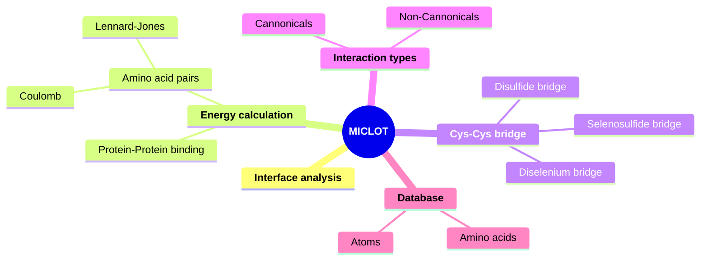

# MICLOT - Molecular InteraCtion anaLysis tOolkiT
MICLOT is a collection of tools for the analysis of protein-protein interactions.

It was designed as a module, written in [Python](https://www.python.org/), to be used in your scripts. It goal is to provide a simple and flexible user experience with efficient tools. 
MICLOT contains many tools. They are independent of each other, and each has its own specificity.

- A **database** contining the physical and chemical proterties of the 20 amino acids. It also contain physical properties of elements (atoms) found in amino acids.
- Protocols for **energy calculation**. One to calculate the Coulomb and Lennard-Jonnes energies of a pair of residues. And another to compute the binding energy between of a protein complex.
- Identification of the **canonical and non-canonical interactions** formed by a pair of residues.
- A tool to detect **Cys-Cys bridges** in a structure. It's contain tow protocol to detect disulfid bridges. But it is also able to identify non-canonical bridges involving: diselenium bond (Se-Se) and selenosulfide bond (Se-S).
- The ability to return the **physico-chemical properties of an interface**, in a protein-protein complex.

(- Statistical and AI based tool to cacacterise the binding between two protein.)

***
## Graphical abstract

***
## Quick installation
### 1. Download the repository
Clone the repository with this command line: `git repo clone TMiclot/xxxxx`

### 2. Create conda environment
We recommend using a Python environment with [Conda](https://docs.conda.io/projects/conda/en/stable/index.html). You can install it with [Miniconda](https://docs.conda.io/projects/miniconda/en/latest/) or [Anaconda](https://www.anaconda.com/download/).

For the easy installation, we provide a file containing all the information concerning the dependencies on which the module has been developed and tested. So to create the needed environment, wrote the command: `conda env create -f miclot.yml`

### 3. Using the module in a Python script
1. Copy all the repositories you have previously downloaded into your working directory. Only *.py* files need to be copied.
2. In your Python script, import the module using this command: `from miclot import *`

***
## Usage & Documentations
- For more details about the technical features and theory behind the software, read the [User guide](User_Guide/Manual.md).
- To start exploring the software, you can begin with the software, take look at the [Tutorials](Tutorial/Tutorials.md).

***
## Citing us
Miclot, T. & Timr, S. The famous title. *Journal* ... 
