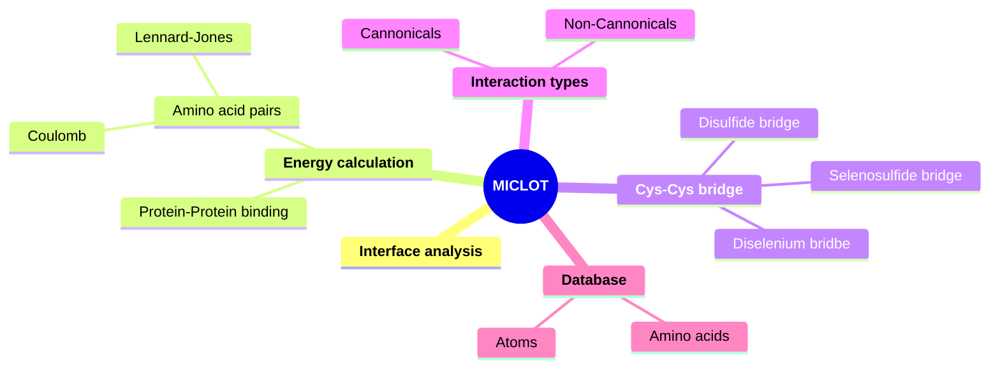

# MICLOT - Molecular InteraCtion anaLysis tOolkiT
MICLOT is a collection of tools for the analysis of protein-protein interactions.

[Python](https://www.python.org/) 

***
## Graphical abstract

***
## Quick installation
### Download the repository
Clone the repository with this command line: `git repo clone TMiclot/xxxxx`

### Create conda environment
We recommend using a Python environment with [Conda](https://docs.conda.io/projects/conda/en/stable/index.html). You can install it with [Miniconda](https://docs.conda.io/projects/miniconda/en/latest/) or [Anaconda](https://www.anaconda.com/download/).

For the easy installation, we provide a file containing all the information concerning the dependencies on which the module has been developed and tested. So to create the needed environment, wrote the command: `conda env create -f miclot.yml`

### Using the module in a Python script
1. Copy all the repositories you have previously downloaded into your working directory. Only *.py* files need to be copied.
2. In your Python script, import the module using this command: `from miclot import *`

***
## Usage & Documentations
- For more details about the technical features and theory behind the software, see the [User guide](User_Guide/Manual.md).
- To start exploring the software, you can begin with the [Tutorials](Tutorial/Tutorial.md).

***
## Citing us
Miclot, T. & Timr, S. The famous title. *Journal* ... 
