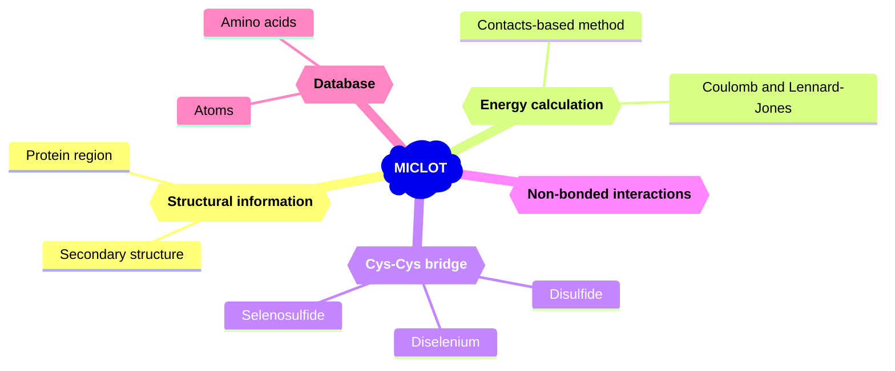

MICLOT (**M**olecular **I**ntera**C**tion ana**L**ysis t**O**olki**T**) is a collection of tools for analyzing protein-protein interactions in PDB files as well as MD simulations.

It was designed as a Python package to be integrated into user scripts, with the goal of providing a simple and flexible user experience with efficient tools. MICLOT comprises several key components:

- A **database** containing the physical and chemical properties of amino acids, as well as physical properties of elements (atoms) found in amino acids.
- Protocols for **energy calculation**, including one to calculate the Coulomb and Lennard-Jones energies of a pair of residues, and another to compute the binding energy of a protein complex.
- Identification of the **non-bonding interactions** (*H-bonds, Pi-Pi stacking, ...*) formed by a pair of residues.
- Functions to detect **Cys-Cys bridges** in a structure, featuring two protocols to detect disulfide bridges, as well as the ability to identify non-canonical bridges involving diselenium bonds (Se-Se) and selenosulfide bonds (Se-S).
- A set of **utilities** to work with structures.
- Tools to assist users in **data analysis** (under development).

# Graphical abstract

# Usage & Documentations

- For detailed instructions on installation, as well as information on the technical features and theoretical background of the software, please refer to the [User guide](User_Guide/Manual.md).
- To begin exploring the capabilities of MICLOT, we recommend starting with the [Tutorials](Tutorial/Tutorials.md), which provide a hands-on introduction to the software.

# Bug report

Currently, we do not have a formal protocol in place for bug report. So please simply send an email to [tom.miclot@jh-inst.cas.cz](tom.miclot@jh-inst.cas.cz)

# Citing us

The article is in preparation, please wait to quote our software.

Made with :heart: by Tom Miclot
