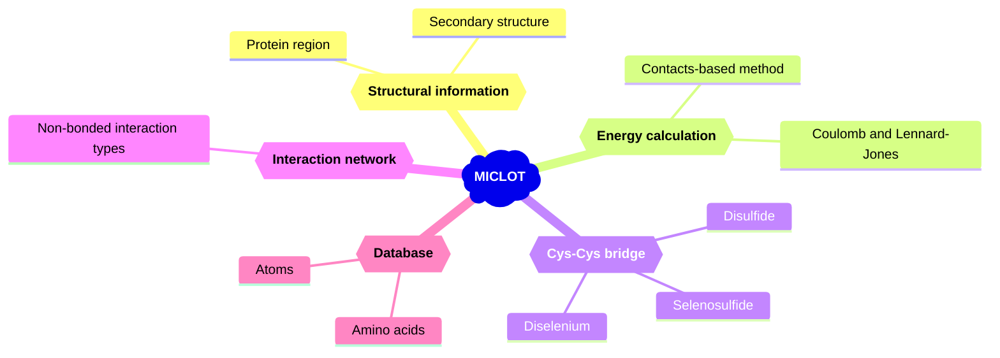

MICLOT (**M**olecular **I**ntera**C**tion ana**L**ysis t**O**olki**T**) is collection of tools for the analysis of protein-protein interactions in PDB files as well as MD simulations.

It was designed as a package, written in [Python](https://www.python.org/), to be used in your scripts. It goal is to provide a simple and flexible user experience with efficient tools. 
MICLOT contains many tools.

- A **database** contining the physical and chemical proterties of the amino acids. It also contain physical properties of elements (atoms) found in amino acids.
- Protocols for **energy calculation**. One to calculate the Coulomb and Lennard-Jonnes energies of a pair of residues. And another to compute the binding energy between of a protein complex.
- Identification of the **non-bonding interactions** formed by a pair of residues.
- Functions to detect **Cys-Cys bridges** in a structure. It's contain tow protocol to detect disulfid bridges. But it is also able to identify non-canonical bridges involving: diselenium bond (Se-Se) and selenosulfide bond (Se-S).
- Set of utilities to work with structures.
- Tools to help user in **data analysis** (*Work in progress*)

# Graphical abstract

# Usage & Documentations

- For **installation** and details about the technical features and theory behind the software, read the [User guide](User_Guide/Manual.md).
- To start exploring the software, you can take look at the [Tutorials](Tutorial/Tutorials.md).

# Contributing

The project seeks to harness the collective expertise and efforts of researchers within a unified project. The ultimate goal is to provide a comprehensive solution, consolidated into a single tool, to adapt to the diverse needs of users.

We invite and welcome contributions from anyone interested in joining our community and contributing to the project's growth. Whether you'd like to develop new features, resolve existing bugs, refine the code, perform tests, enhance the documentation, create tutorials, or share your ideas, we encourage your participation.

Currently, we do not have a formal protocol in place for contributions. So please simply send an email to [tom.miclot@jh-inst.cas.cz](tom.miclot@jh-inst.cas.cz)

# Citing us

Miclot, T. & Timr, S. The famous title. *Journal* ... 

Made with :heart: by Tom Miclot
