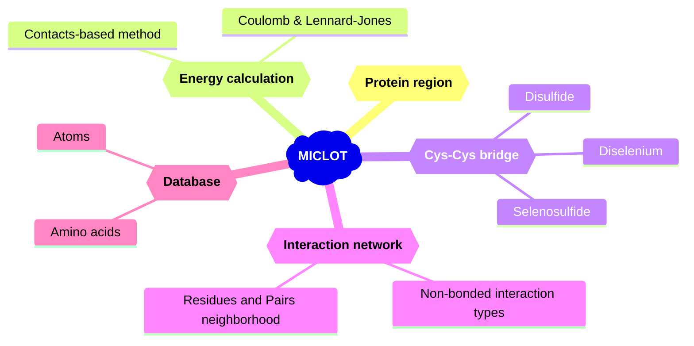

MICLOT (**M**olecular **I**ntera**C**tion ana**L**ysis t**O**olki**T**) is collection of tools for the analysis of protein-protein interactions.

It was designed as a package, written in [Python](https://www.python.org/), to be used in your scripts. It goal is to provide a simple and flexible user experience with efficient tools. 
MICLOT contains many tools.

- A **database** contining the physical and chemical proterties of the amino acids. It also contain physical properties of elements (atoms) found in amino acids.
- Protocols for **energy calculation**. One to calculate the Coulomb and Lennard-Jonnes energies of a pair of residues. And another to compute the binding energy between of a protein complex.
- Identification of the **canonical and non-canonical interactions** formed by a pair of residues.
- A tool to detect **Cys-Cys bridges** in a structure. It's contain tow protocol to detect disulfid bridges. But it is also able to identify non-canonical bridges involving: diselenium bond (Se-Se) and selenosulfide bond (Se-S).
- The ability to return the **physico-chemical properties of an interface**, in a protein-protein complex.

(- Statistical and AI based tool to cacacterise the binding between two protein.)

# Graphical abstract

# Usage & Documentations
- For **installation** and details about the technical features and theory behind the software, read the [User guide](User_Guide/Manual.md).
- To start exploring the software, you can take look at the [Tutorials](Tutorial/Tutorials.md).

# Citing us
Miclot, T. & Timr, S. The famous title. *Journal* ... 

Made with :heart: by Tom Miclot
