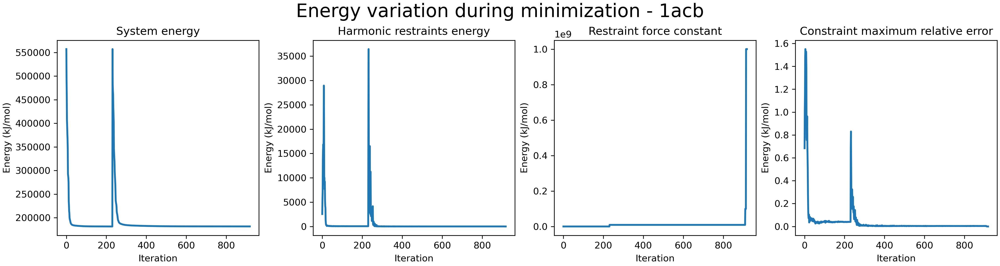

[Tutorials home](Tutorials.md)

# Analyze generated data

## First step: load required modules

```python
import sys

# Define the path to of the package
package_dir = '/path/to/MICLOT'

# Add the 'miclot' package directory to sys.path
if package_dir not in sys.path:
    sys.path.insert(0, package_dir)
```

Now you can import the packages:

```python
import miclot.data_analysis as mca
```


## A. Clean data

### A.1. Clean structure information

**Code**

```python
cleaning.structure('/Data/1acb')
```

**Result**

Return the dataframe and save it as CSV file.


### A.2. Clean neighbor residues

**Code**

```python
cleaning.neighbor_residues('/Data/1acb')
```

**Result**

Return the dataframe and save it as CSV file.


### A.3. Clean interactions table

**Code**

```python
cleaning.interactions_table('/Data/1acb')
```

**Result**

Return the dataframe and save it as CSV file.


## B. Concatenate CSV files

### B.1. Concatenate any CSV files, based on name (or motif in name)

**Code**

```python
concatenate.csv_file('/Data', 'uniprot', use_tqdm=True)
```

**Result**

Concatenate all CSV file contained 'uniprot' in their name and located in subdirectories of '/Data', and display progress bar. The final file is written as 'final_uniprot.csv' and logfile name 'concatenate_uniprot.log' is created.


### B.2. Concatenate all files containing ASA information

**Code**

```python
df = concatenate.ASA('/Data')
print(df)
```

**Result**

The final CSV file is written. 

```python
        complex      receptor       ligand    interface   PDB
0  13146.739273  10505.114157  4322.435392  1680.810276  1acb
1  10313.511142   5628.519333  6421.277673  1736.285864  1i8k
2  10064.572511   5926.323958  5809.856860  1671.608307  4h5s
...
```


### B.3. Concatenate all *interaction_table* files

**Code**

```python
concatenate.interaction_table('/Data')
```

**Result**

The final CSV file is written. 


### B.4. Concatenate all *neighbor_residues* files

**Code**

```python
concatenate.neighbor_residues('/Data')
```

**Result**

The final CSV file is written.


### B.5. Concatenate all *neighbor_pairs* files

**Code**

```python
concatenate.neighbor_pairs('/Data')
```

**Result**

The final CSV file is written.


### B.6. Concatenate all *structure* files

**Code**

```python
concatenate.structure('/Data')
```

**Result**

The final CSV file is written.


# C. Class `plot`

## C.1. Plot minimization energies

### C.1.1. Normal usage

It is possible to prive directory or file path in the command.

```python
# directory path
a = plot.minimization('/Data/1acb/')
a.show()
```

```python
# file path
a = plot.minimization('/Data/1acb/1acb_noHETATM_pqr_fixed_minimization_log.csv')
a.show()
```

### C.1.2. Change the structure name in the title

If you want to change the name in the title, you can modify it using `pdb_name` argument.

```python
a = plot.minimization('/Data/1acb/1acb_noHETATM_pqr_fixed_minimization_log.csv', pdb_name='Hydrolase/Hydrolase inhibitor')
a.show()
```

### C.1.3. Saving the graph

```python
plot.minimization('/Data/1acb/1acb_noHETATM_pqr_fixed_minimization_log.csv', save_graph=True)
```

### C.1.4. Example of output




## D. Remove files

### D.1. Remove all generated plots

**Code**

```python
removed_files, error = remove.plots('/Data/1acb')
print(removed_files)
print(error)
```

**Result**

```
['/Data/1acb/1acb_noHETATM_pqr_fixed_minimization_log_plot_minimization_energies.png']
[]
```


### D.2. Remove all generated clean data

**Code**

```python
remove.clean_data('/Data/1acb')
```

**Result**

Remove all CSV files with 'clean' in their name.


### D.3. Remove all generated saved class files

**Code**

```python
remove.pickles('/Data/1acb')
```

**Result**

Remove all pkl.gz files with 'class' in their name.


### D.4. Remove any file(s)

**Code**

```python
remove.files('/Data/1acb', name='hydrolase', file_format='pdb')
```

**Result**

Remove any pdb file containing 'hydrolase' in their name in the directory '/Data/1acb'.


# E. (Re)Generate the distance map

> [!IMPORTANT]
> Normally the distance map is automatically generated by `neighbor_residues` or `neighbor_pairs` commands if the file **.distance_map.csv* don't exist. But if any problem occure, it'is possible to regenerate it using the following command.

**Code**

```python
make_distance_map('/Data/1acb')
```

**Result**

Generate the file *1acb_distance_map.csv*