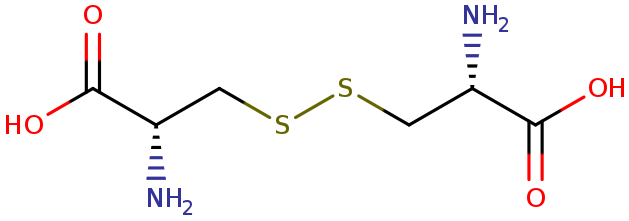
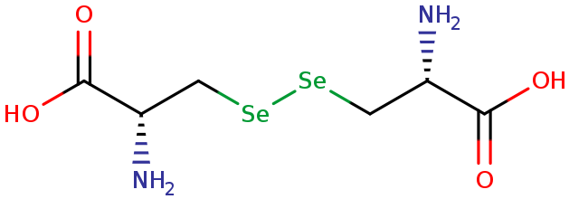
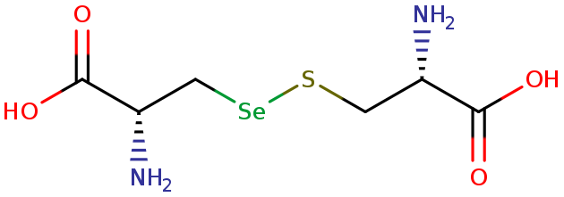
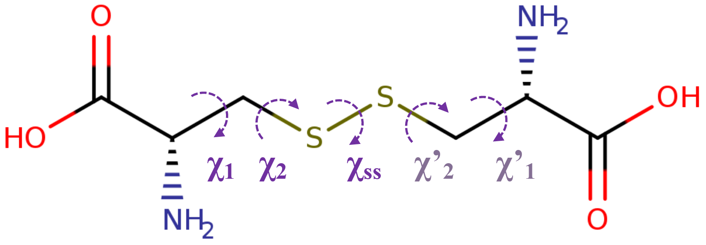
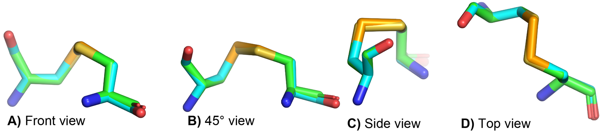

[User Guide home](Manual.md)
# Sulfur and Selenium bridges in (seleno)cystein
Two cysteines can form a covalent bond between their chalcogen atoms. But in some cases, this information is not explicitly given in PDB files. 

| Structure                                                    | Name                 | Synonyms                                                        | Atoms forming the bridge | Description |
| ------------------------------------------------------------ | -------------------- | --------------------------------------------------------------- |------------------------- | ----------- |
|     | Disulfide bridge     | SS-bond, disulfide linkages, crosslink, cross-strand disulfides | S-S                      | Covalent bond between sulfure atoms in thiol groups of tow CYS. |
|    | Diselenide bridge    |                                                                 | Se-Se                    | Covalent bond between selenium atoms in selenol groups of tow SEC. |
|  | Selenosulfide bridge |                                                                 | S-Se                     | Covalent bond between sulfure atom in thiol groups of a CYS and the selenium atom in selenol groups of a SEC. |

## 1. Disulfure bridge

> [!NOTE]
> $\chi_{SS}$ is also named $\chi_{3}$ or $\tau(SS)$

### 1.1. Distance parameters
| Distance            | Reference value (Å) | Range values (Å)    | Comments |
| ------------------- | ----------------------- | ----------------------- | --- |
| S-S                 | 2.04                    | d $\leq$ 2.1            | The reference value is the rounded value of 2.038 Å for C-**S-S**-C with $\tau(SS)$ = 75-105˚  in [CRC Handbook (2016)](https://doi.org/10.1201/9781315380476), and it corellate with the value of 2.04 used by [Dombkowski *et al.* (2003)](https://doi.org/10.1093/bioinformatics/btg231). The maximum in the range value is the rouned value of 2.077 Å for C-**S-S**-C [(CRC Handbook, 2016)](https://doi.org/10.1201/9781315380476). So the range value is round to 2.1 Å.|
| $C_\beta-S$         | 1.81                    |                         | The reference value is used by [Dombkowski *et al.* (2003)](https://doi.org/10.1093/bioinformatics/btg231). It is close to the mean distance reported for **C-S**-H: 1.808 Å, but it differs from the mean distance reported for C-**C-S**-S-*X*: 1.863 Å. |
| $C_\alpha-C_\alpha$ |                         | 3.0 $\leq$ d $\leq$ 7.5 | Same range used by [Gao *et al.*, 2020](https://doi.org/10.1038/s41598-020-67230-z).    |
| $C_\beta-C_\beta$   |                         | $\leq$ 5.5              |     |

### 1.2. Angle parameters
| Symbol     | Angle                  | Reference value (degree) |
| ---------- | ---------------------- | ------------------------ |
| $\theta$   | $C_\alpha-C_\beta-S$   | ($\theta_0$) 114.6       |
|            | $C_\beta-S-S$          | 104.15                   |
| $\chi_{1}$ | $N-C_\alpha-C_\beta-S$ | $\pm$ 60 or $\pm$ 180   |
| $\chi_{2}$ | $C_\alpha-C_\beta-S-S$ |                          |
| $\chi_{3}$ | $C_\beta-S-S-C_\beta$  | +97 or -87              |

### 1.3. Energy computation: *Disulfide by Design 2* method
The disulfide bridge energy value (in kcal/mol) is calulated using the following equation from [Dombkowski *et al.* (2003)](https://doi.org/10.1093/bioinformatics/btg231) and [Craig *et al.* (2013)](https://doi.org/10.1186/1471-2105-14-346) where i and j are residue indices:

$$
\begin{equation}
	E_{ij} =  E_{\chi_{1,i}} + E_{\chi_{1,j}} + E_{\chi_{3}} + E_{\theta,i} + E_{\theta,j}
\end{equation}
$$

The components of the equation are calculated according to the following:

$$
\begin{align}
	E_{\chi_{1}} & =  1.4 \left( 1 + \cos \left(3 \chi_{1} \right)  \right)  \\
	E_{\chi_{3}} & = 4.0 \left( 1 - \cos \left(1.957  \left( \chi_{3} + 87.0 \right) \right)  \right) \\
	E_{\theta} & = 55.0 \left( \theta - \theta_0 \right) ^2  \times \frac{1}{4184}
\end{align}
$$

> [!NOTE]
> - Remember that the reference angular parameter $\theta_0$ is set to 114.6°.
> - *The mean value is 1.0 kcal/mol, and the 90th percentile is 2.2 kcal/mol*. [(Craig *et al.*, 2013)](https://doi.org/10.1186/1471-2105-14-346).

> [!WARNING]
> - Compare to the original equation, we modify the term $E_{\theta}$ by multiplying it by the factor $\frac{1}{4184}$ to be able to reproduce the results of [Disulfide by Design 2.0 web server](http://cptweb.cpt.wayne.edu/DbD2/). The use of this factor is not written in the server documentation, nor in their publications.

### 1.4. Energy computation: *Dihedral strain energy* method
The dihedral strain energy (in kJ/mol) is calculated using the following from [Schmidt *et al.* (2006)](https://doi.org/10.1021/bi0603064), and base on empirical studies ([Weiner *et al.*, 1984](https://doi.org/10.1021/ja00315a051) and [Katz and Kossiakoff, 1986](https://doi.org/10.1016/S0021-9258(18)66737-7)):

$$
E_{ij} =  E_{\chi_{1,i}} + E_{\chi_{1,j}}  + E_{\chi_{2,i}} + E_{\chi_{2,j}} + E_{\chi_{3}}
$$

The components of the equation are calculated according to the following:

$$
\begin{align}
	E_{\chi_{1}} & = 8.37(1 + cos(3\chi_{1})) \\
	E_{\chi_{2}} & = 4.18(1 + cos(3\chi_{2}))\\
	E_{\chi_{3}} & = 14.64(1 + cos(2\chi_{3})) + 2.51(1 + cos(3\chi_{3}))
\end{align}
$$

### 1.5. References
- Bond lengths in crystalline organic compounds. in *CRC Handbook of chemistry and physics* (eds. Haynes, W. M., Lide, D. R. & Bruno, T. J.) 9–1 (CRC Press, 2016). [https://doi.org/10.1201/9781315380476](https://doi.org/10.1201/9781315380476)
- Mantina, M., Valero, R., Cramer, C. J. & Truhlar, D. G. Atomic radii of the elements. in *CRC Handbook of chemistry and physics* (eds. Haynes, W. M., Lide, D. R. & Bruno, T. J.) 9–57 (CRC Press, 2016). [https://doi.org/10.1201/9781315380476](https://doi.org/10.1201/9781315380476)
- Gao, X., Dong, X., Li, X., Liu, Z. & Liu, H. Prediction of disulfide bond engineering sites using a machine learning method. *Sci Rep* 10, 10330 (2020). [https://doi.org/10.1038/s41598-020-67230-z](https://doi.org/10.1038/s41598-020-67230-z)
- Deplazes, E., Chin, Y. K. ‐Y., King, G. F. & Mancera, R. L. The unusual conformation of cross‐strand disulfide bonds is critical to the stability of β‐hairpin peptides. Proteins 88, 485–502 (2020). [https://doi.org/10.1002/prot.25828](https://doi.org/10.1002/prot.25828)
- Dombkowski, A. A., Sultana, K. Z. & Craig, D. B. Protein disulfide engineering. FEBS Letters 588, 206–212 (2014). [https://doi.org/10.1016/j.febslet.2013.11.024](https://doi.org/10.1016/j.febslet.2013.11.024)
- Craig, D. B. & Dombkowski, A. A. Disulfide by Design 2.0: a web-based tool for disulfide engineering in proteins. *BMC Bioinformatics* 14, 346 (2013). [https://doi.org/10.1186/1471-2105-14-346](https://doi.org/10.1186/1471-2105-14-346])
- Dombkowski, A. A. Disulfide by Design™: a computational method for the rational design of disulfide bonds in proteins. *Bioinformatics* 19, 1852–1853 (2003). [https://doi.org/10.1093/bioinformatics/btg231](https://doi.org/10.1093/bioinformatics/btg231)
- Schmidt, B., Ho, L. & Hogg, P. J. Allosteric Disulfide Bonds. *Biochemistry* 45, 7429–7433 (2006). [https://doi.org/10.1021/bi0603064](https://doi.org/10.1021/bi0603064)
- Weiner, S. J. et al. A new force field for molecular mechanical simulation of nucleic acids and proteins. *J. Am. Chem. Soc.* 106, 765–784 (1984). [https://doi.org/10.1021/ja00315a051](https://doi.org/10.1021/ja00315a051)
- Katz, B. A. & Kossiakoff, A. The crystallographically determined structures of atypical strained disulfides engineered into subtilisin. *Journal of Biological Chemistry* 261, 15480–15485 (1986). [https://doi.org/10.1016/S0021-9258(18)66737-7](https://doi.org/10.1016/S0021-9258(18)66737-7)

## 2. Diselenide bridge and Selenosulfide bridge
*The literature is less extensive when it comes to structural and energetic parameters for detecting diselenide and selenosulfide bridges. This section give therefore not exhaustive informations regarding this bridges. This is to explain the choices made regarding the method of detection.*

The figure below illustrates the superposition of cystine and seleno-cystine from the crystalline structures of insulin ([PDB ID: 2BN3](https://www.rcsb.org/structure/2BN3)) and seleno-insulin ([PDB ID: 5AZZ](https://www.rcsb.org/structure/5AZZ)). Their superposition is relatively good, indicating small structural differences. 

When comparing distance and angle values, we observe that they are globally consistent with each other. Even though the Se-Se distance found in the [PDB ID: 5AZZ](https://www.rcsb.org/structure/5AZZ) structure is somewhat weaker than the other values found in the [cystal structure of seleno-cystine](https://doi.org/10.1107/S205698901501021X) and in the [CRC Handbook (2016)](https://doi.org/10.1201/9781315380476). This reinforces the ided of a strong structural similarity between cystine and seleno-cysyine.

|               | [2BN3](https://doi.org/10.1107/S0907444905019360)      |         | [5AZZ](https://doi.org/10.1002/anie.201701654)        |         | [seleno-l-cystine](https://doi.org/10.1107/S205698901501021X) |        | [CRC Handbook (2016)](https://doi.org/10.1201/9781315380476) |     |
| ------------- | --------- | ------- | ----------- | ------- | ---------------- | ------ | ------------------ | --- |
| **Distances** | S-S       | 2.058   | Se-Se       | 1.878   | Se-Se            | 2.3213 | X-Se-Se-X          | 2.315 $\leq$ d  $\leq$ 2.361 |
|               | Cb-S      | 1.807   | Cb-Se       | 1.940   | Cb-Se            | 1.9671 | $2 \times {Se}_{radii \space covalent}$ | 2.36 |
|               | Cb-S      | 1.785   | Cb-Se       | 1.919   |                  |        | C-Se               | 1.948  $\leq$ d  $\leq$ 1.998 |
| **Angles (Å)**    | Cb-S-S    | 104.586 | Cb-Se-Se    | 109.861 | Cb-Se-Se         | 100.88 |                    |     |
|               | Cb-S-S    | 104.891 | Cb-Se-Se    | 104.279 |                  |        |                    |     |
|               | Ca-Cb-S   | 113.448 | Ca-Cb-Se    | 112.925 |                  |        |                    |     |
|               | Ca-Cb-S   | 115.859 | Ca-Cb-Se    | 115.500 |                  |        |                    |     |
| **Dihedrals (Å)** | Cb-S-S-Cb | 95.778  | Cb-Se-Se-Cb | 90.006  |                  |        |                    |     |
|               | N-Ca-Cb-S | -57.784 | N-Ca-Cb-Se  | -60.295 |                  |        |                    |     |
|               | N-Ca-Cb-S | 170.374 | N-Ca-Cb-Se  | 171.590 |                  |        |                    |     |

The recent work by [Reddy et al (2020)](https://doi.org/10.1016/j.compbiolchem.2022.107635) compares disulfide, diselenide and selenosulfide bridges using quantum calculations. It shows a good match with the present information. However, some values show rather significant differences. For example, the Se-Se distance is close to 2.51 Å. The differences can be explained by their use of a Cys-Cys, or Cys-Sec, or Sec-Sec dipeptide. It is possible that the formation of the peptide bond between the two amino acids induces stresses, causing changes in the structural parameters encountered when the amino acids are not directly linked together by a peptide bond.

### 2.2. Parameters used
The structural parameters used to detect disulfide bridges are general enough to be applied to diselenine and selenosulfide bridges. And the Se-S and Se-Se distances used correspond to the covalent radii of these atoms (Se-Se: 2.36, S-Se: 2.22) +0.05 .

But the S-S bond energy calculation method cannot be applied to S-Se and Se-Se bonds, because it is not calibrated for them.

So only structural parameters will be used to detect bridging diselenides and selenosulfides.

| Distance | Range values (Å) |
| -------- | -------------------- |
| Se-Se    | d $\leq$ 2.41        |
| S-Se     | d $\leq$ 2.27        |

### 2.3. References
- Görbitz, C. H., Levchenko, V., Semjonovs, J. & Sharif, M. Y. Crystal structure of seleno-l-cystine dihydrochloride. Acta Cryst E 71, 726–729 (2015). [https://doi.org/10.1107/S205698901501021X](https://doi.org/10.1107/S205698901501021X)
- Reddy, K. K. A., Sahoo, D. K., Moi, S. & Gowd, K. H. Conformational change due to replacement of disulfide with selenosulfide and diselenide in dipeptide vicinal cysteine loop. Computational Biology and Chemistry 97, 107635 (2022). [https://doi.org/10.1016/j.compbiolchem.2022.107635](https://doi.org/10.1016/j.compbiolchem.2022.107635)
- Bond lengths in crystalline organic compounds. in *CRC Handbook of chemistry and physics* (eds. Haynes, W. M., Lide, D. R. & Bruno, T. J.) 9–1 (CRC Press, 2016). [https://doi.org/10.1201/9781315380476](https://doi.org/10.1201/9781315380476)
- Mantina, M., Valero, R., Cramer, C. J. & Truhlar, D. G. Atomic radii of the elements. in *CRC Handbook of chemistry and physics* (eds. Haynes, W. M., Lide, D. R. & Bruno, T. J.) 9–57 (CRC Press, 2016). [https://doi.org/10.1201/9781315380476](https://doi.org/10.1201/9781315380476)
- Crystal structure of seleno-insulin (PDB ID: 5AZZ). from Arai, K. *et al.* Preparation of Selenoinsulin as a Long‐Lasting Insulin Analogue. *Angew Chem Int Ed* 56, 5522–5526 (2017). [https://doi.org/10.1002/anie.201701654](https://doi.org/10.1002/anie.201701654)
- Crystal structure of insulin (PDB ID: 2BN3). from Nanao, M. H., Sheldrick, G. M. & Ravelli, R. B. G. Improving radiation-damage substructures for RIP. *Acta Crystallogr D Biol Crystallogr* 61, 1227–1237 (2005). [https://doi.org/10.1107/S0907444905019360](https://doi.org/10.1107/S0907444905019360)
