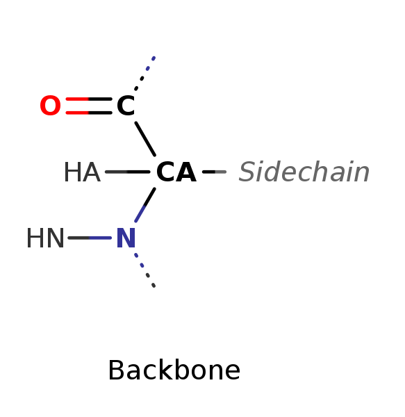
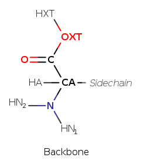
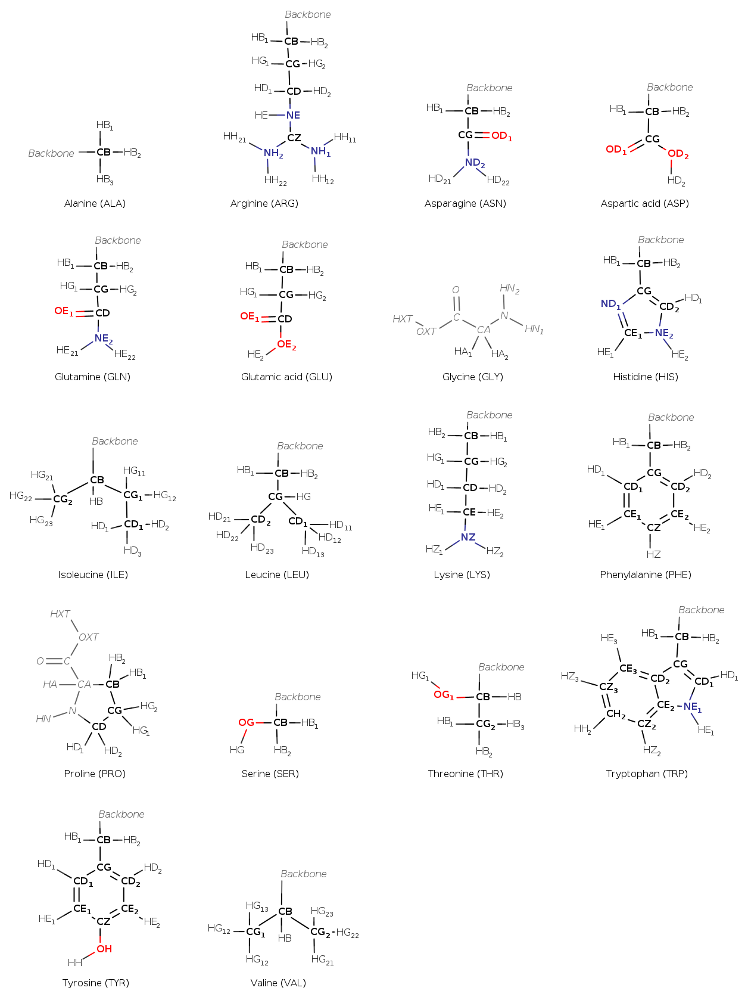
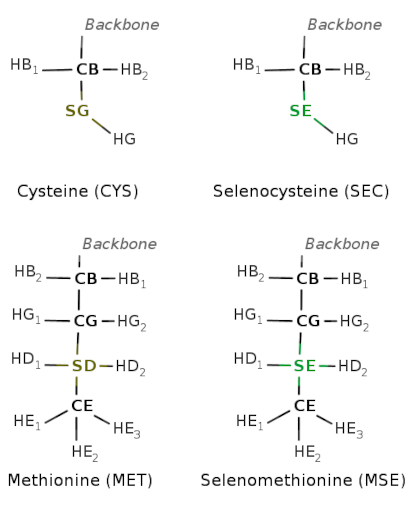
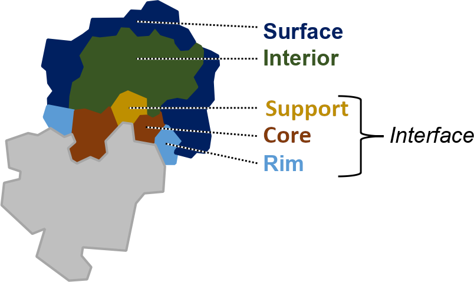

[User Guide home](Manual.md)
# Amino acids properties

## 1. Standard atom names use in PDB and Force field
For reasons of space, the numbers in the names are written in subscript. Backbone atome are alway replased by: *backbone*, else for GLY and PRO they are given in grey italics.

### 1.1. Backbone
 OR 

### 1.2. Side chaine *without CYS and MET*

### 1.3. Cystein, Methionine, Selenocystein and Selenomethionine

## 2. The 3 letter codes of standard residues in PDB
The table below refers to the standard items found in the PDB files. It use standard atom and residue nomenclature as described in the [monomer section](https://files.wwpdb.org/pub/pdb/data/monomers) of the Chemical Component Dictionary. Some code name may change or not be recognize, depending on the force field. For more information see [Standard residues in MDAnalysis selections](https://userguide.mdanalysis.org/stable/standard_selections.html) to find out which types of residue are recognized and selectable by MDAnalysis.

| Amino acid    | Standard code | Reduced | Oxydized | Neutral     | Deprotonated (Negative charge) | Protonated (Positive charge) | Selenium containing |
| ------------- | ------------- | ------- | -------- | ---------- | ------------ | ---------- | ------------------- |
| Alanine       | ALA           |         |          |            |              |            |     |
| Arginine      | ARG           |         |          |            |              |            |     |
| Asparagine    | ASN           |         |          |            |              |            |     |
| Aspartate     | ASP           | ASH     |          |            |              |            |     |
| Cysteine      | CYS           | CYH     | CYX      |            | CYM          |            | SEC |
| Glutamate     | GLU           | GLH     |          |            |              |            |     |
| Glutamine     | GLN           |         |          |            |              |            |     |
| Glycine       | GLY           |         |          |            |              |            |     |
| Histidine     | HIS           |         |          | HID or HIE (HSD or HSE in CHARMM36) |              | HIP (HSP in CHARMM36)        |     |
| Isoleucine    | ILE           |         |          |            |              |            |     |
| Leucine       | LEU           |         |          |            |              |            |     |
| Lysine        | LYS           |         |          | LYN        |              |            |     |
| Methionine    | MET           |         |          |            |              |            | MSE |
| Phenylalanine | PHE           |         |          |            |              |            |     |
| Proline       | PRO           |         |          |            |              |            |     |
| Serine        | SER           |         |          |            |              |            |     |
| Threonine     | THR           |         |          |            |              |            |     |
| Tryptophan    | TRP           |         |          |            |              |            |     |
| Tyrosine      | TYR           |         |          |            | TYM          |            |     |
| Valine        | VAL           |         |          |            |              |            |     |
| Pyrrolysisne  | PYL           |         |          |            |              |            |     |
| GLU or GLN    | GLX           |         |          |            |              |            |     |
| ASP or ASN    | ASX           |         |          |            |              |            |     |
| Unknown       | UNK           |         |          |            |              |            |     |

> [!NOTE]  
> - HID: Neutral HIS, proton HD1 present.
> - HIE: Neutral HIS, proton HE2 present.
> - CYX: SS-bonded CYS, also named Cystine.
> - C-terminal residue contain an C a the begining (ex.: CPHE) & N-ternimal residues contain an N at the begining (ex.: NPHE).

### References
- Lee, J. et al. CHARMM-GUI supports the Amber force fields. *The Journal of Chemical Physics* 153, 035103 (2020). [https://doi.org/10.1063/5.0012280](https://doi.org/10.1063/5.0012280)
- Westbrook, J. D. et al. The chemical component dictionary: complete descriptions of constituent molecules in experimentally determined 3D macromolecules in the Protein Data Bank. *Bioinformatics* 31, 1274–1278 (2015). [http://dx.doi.org/10.1093/bioinformatics/btu789](http://dx.doi.org/10.1093/bioinformatics/btu789)
- CHARMM Small Molecule Library (CSML) [https://www.charmm-gui.org/?doc=archive&lib=csml](https://www.charmm-gui.org/?doc=archive&lib=csml)

## 3. Maximum ASA in proteins
The table below give the maximum possible solvent accessible surface area (ASA) for the residue, according to various sources.

| Residue | [Tien *et al.* (2013)](https://doi.org/10.1371/journal.pone.0080635) Theoretical | [Tien *et al.* (2013)](https://doi.org/10.1371/journal.pone.0080635) Empirical | [Miller *et al.* (1987)](https://doi.org/10.1016/0022-2836%2887%2990038-6 "https://doi.org/10.1016/0022-2836(87)90038-6") | [Rose *et al.* (1985)](https://doi.org/10.1126/science.4023714) | [Lins *et al.* (2003)](https://doi.org/10.1110/ps.0304803) | [Samanta *et al.* (2002)](https://doi.org/10.1093/protein/15.8.659) Gly-x-Gly | [Samanta *et al.* (2002)](https://doi.org/10.1093/protein/15.8.659) Ala-X-Ala |
| --- | ------ | ------ | ------ | ------ | ------ | ------ | ------ |
| ALA | 129.00 | 121.00 | 113.00 | 118.10 | 111.00 | 116.40 |  55.40 |
| ARG | 274.00 | 265.00 | 241.00 | 256.00 | 250.00 | 249.26 | 190.24 |
| ASN | 195.00 | 187.00 | 158.00 | 165.50 | 166.00 | 168.87 | 109.92 |
| ASP | 193.00 | 187.00 | 151.00 | 158.70 | 160.00 | 155.37 |  97.80 |
| CYS | 167.00 | 148.00 | 140.00 | 146.10 | 157.00 | 141.48 |  82.07 |
| GLN | 225.00 | 214.00 | 189.00 | 193.20 | 187.00 | 189.17 | 129.68 |
| GLU | 223.00 | 214.00 | 183.00 | 186.20 | 194.00 | 187.16 | 132.53 |
| GLY | 104.00 |  97.00 |  85.00 |  88.10 |  86.00 |  83.91 | *No data* |
| HIS | 224.00 | 216.00 | 194.00 | 202.50 | 191.00 | 198.51 | 141.27 |
| ILE | 197.00 | 195.00 | 182.00 | 181.00 | 173.00 | 189.95 | 130.71 |
| LEU | 201.00 | 191.00 | 180.00 | 193.10 | 179.00 | 197.99 | 141.52 |
| LYS | 236.00 | 230.00 | 211.00 | 225.80 | 212.00 | 207.49 | 147.99 |
| MET | 224.00 | 203.00 | 204.00 | 203.40 | 201.00 | 210.55 | 150.39 |
| PHE | 240.00 | 228.00 | 218.00 | 222.80 | 208.00 | 223.29 | 164.18 |
| PRO | 159.00 | 154.00 | 143.00 | 146.80 | 135.00 | 144.80 | 106.44 |
| SER | 155.00 | 143.00 | 122.00 | 129.80 | 125.00 | 125.68 |  69.08 |
| THR | 172.00 | 163.00 | 146.00 | 152.50 | 144.00 | 148.06 |  88.62 |
| TRP | 285.00 | 264.00 | 259.00 | 266.30 | 249.00 | 265.42 | 209.62 |
| TYR | 263.00 | 255.00 | 229.00 | 236.80 | 227.00 | 238.30 | 180.03 |
| VAL | 174.00 | 165.00 | 160.00 | 164.50 | 149.00 | 162.24 | 103.12 |

### References
- Samanta, U., Bahadur, R. P. & Chakrabarti, P. Quantifying the accessible surface area of protein residues in their local environment. *Protein Engineering, Design and Selection* 15, 659–667 (2002). [https://doi.org/10.1093/protein/15.8.659](https://doi.org/10.1093/protein/15.8.659)
- Lins, L., Thomas, A. & Brasseur, R. Analysis of accessible surface of residues in proteins. *Protein Science* 12, 1406–1417 (2003). [https://doi.org/10.1110/ps.0304803](https://doi.org/10.1110/ps.0304803)
- Tien, M. Z., Meyer, A. G., Sydykova, D. K., Spielman, S. J. & Wilke, C. O. Maximum Allowed Solvent Accessibilites of Residues in Proteins. *PLoS ONE* 8, e80635 (2013). [https://doi.org/10.1371/journal.pone.0080635](https://doi.org/10.1371/journal.pone.0080635)
- Miller, S., Janin, J., Lesk, A. M. & Chothia, C. Interior and surface of monomeric proteins. *Journal of Molecular Biology* 196, 641–656 (1987). [https://doi.org/10.1016/0022-2836(87)90038-6](https://doi.org/10.1016/0022-2836(87)90038-6)
- Rose, G. D., Geselowitz, A. R., Lesser, G. J., Lee, R. H. & Zehfus, M. H. Hydrophobicity of Amino Acid Residues in Globular Proteins. *Science* 229, 834–838 (1985). [https://doi.org/10.1126/science.4023714](https://doi.org/10.1126/science.4023714)

## 4. Physico-chemical properties of amino acids
| Residue | Molecular weight | Volume ($A^3$) [Zamyatnin *et al.* (1972)](https://doi.org/10.1016/0079-6107(72)90005-3)| Melting point (˚C) | $pK_a$  | $pK_b$   | $pK_c$   | pI    | Solubility in water (g/ kg) | $V_0^2$ (cm$^3$/mol) | Hydropathy [Kyte *et al.* (1982)](https://doi.org/10.1016/0022-2836(82)90515-0)| Hydropathy classe  | Chemical classe  | Physico-chemical classe  | Charge              | Polarity | Hydrogen donor / acceptor |
| ------- | ---------------- | ------ | ------------------ | ---- | ----- | ----- | ----- | --------------------------- | -------------------- | ---------- | ------------------ | ---------------- | ------------------------ | ------------------- | -------- | ------------------------- |
| Ala     |  89.09           |  88.6  | 297                | 2.33 |  9.71 |       |  6.00 | 166.9                       | 60.54                |  1.8       | hydrophobic        | aliphatic        | aliphatic                | neutral             | nonpolar | none                      |
| Arg     | 174.20           | 173.4  | 244                | 2.03 |  9.00 | 12.10 | 10.76 | 182.6                       | 127.42               | -4.5       | hydrophilic        | basic            | basic                    | positive or neutral | polar    | donor                     |
| Asn     | 132.12           | 114.1  | 235                | 2.16 |  8.73 |       |  5.41 | 25.1                        | 78.0                 | -3.5       | hydrophilic        | amide            | amide                    | neutral             | polar    | donor and acceptor        |
| Asp     | 133.10           | 111.1  | 270                | 1.95 |  9.66 | 3.71  |  2.77 | 5.04                        | 74.8                 | -3.5       | hydrophilic        | acidic           | acidic                   | negative or neutral | polar    | acceptor                  |
| Cys     | 121.16           | 108.5  | 240                | 1.91 | 10.28 | 8.14  |  5.07 | *Very soluble*              | 73.45                |  2.5       | hydrophobic        | sulfur           | sulfur                   | neutral             | nonpolar | none                      |
| Gln     | 146.14           | 143.8  | 185                | 2.18 |  9.00 |       |  5.65 | 42.5                        |                      | -3.5       | hydrophilic        | amide            | amide                    | neutral             | polar    | donor and acceptor        |
| Glu     | 147.13           | 138.4  | 160                | 2.16 |  9.58 | 4.15  |  3.22 | 8.6                         | 89.85                | -3.5       | hydrophilic        | acidic           | acidic                   | negative or neutral | polar    | acceptor                  |
| Gly     |  75.07           |  60.1  | 290                | 2.34 |  9.58 |       |  5.97 | 250.2                       | 43.26                | -0.4       | neutral            | aliphatic        | G                        | neutral             | nonpolar | none                      |
| His     | 155.15           | 153.2  | 287                | 1.70 |  9.09 | 6.04  |  7.59 | 43.5                        | 98.3                 | -3.2       | neutral            | basic            | basic                    | positive or neutral | polar    | donor and acceptor        |
| Ile     | 131.17           | 166.7  | 284                | 2.26 |  9.60 |       |  6.02 | 34.2                        | 105.8                |  4.5       | hydrophobic        | aliphatic        | aliphatic                | neutral             | nonpolar | none                      |
| Leu     | 131.17           | 166.7  | 293                | 2.32 |  9.58 |       |  5.98 | 22.0                        | 107.77               |  3.8       | hydrophobic        | aliphatic        | aliphatic                | neutral             | nonpolar | none                      |
| Lys     | 146.19           | 168.6  | 224                | 2.15 |  9.16 | 10.67 |  9.74 | 5.8                         | 108.5                | -3.9       | hydrophilic        | basic            | basic                    | positive or neutral | polar    | donor                     |
| Met     | 149.21           | 162.9  | 281                | 2.16 |  9.08 |       |  5.74 | 56                          | 105.57               |  1.9       | hydrophobic        | sulfur           | sulfur                   | neutral             | nonpolar | none                      |
| Phe     | 165.19           | 189.9  | 283                | 2.18 |  9.09 |       |  5.48 | 27.9                        | 121.5                |  2.8       | hydrophobic        | aromatic         | F                        | neutral             | nonpolar | none                      |
| Pro     | 115.13           | 112.7  | 221                | 1.95 | 10.47 |       |  6.30 | 1622                        | 82.76                | -1.6       | neutral            | aliphatic        | P                        | neutral             | nonpolar | none                      |
| Ser     | 105.09           |  89.0  | 228                | 2.13 |  9.05 |       |  5.68 | 250                         | 60.62                | -0.8       | neutral            | hydroxyl         | hydroxyl                 | neutral             | polar    | donor and acceptor        |
| Thr     | 119.12           | 116.1  | 256                | 2.20 |  8.96 |       |  5.60 | 98.1                        | 76.9                 | -0.7       | neutral            | hydroxyl         | hydroxyl                 | neutral             | polar    | donor and acceptor        |
| Trp     | 204.23           | 227.8  | 289                | 2.38 |  9.34 |       |  5.89 | 13.2                        | 143.8                | -0.9       | hydrophobic        | aromatic         | W                        | neutral             | nonpolar | donor                     |
| Tyr     | 181.19           | 193.6  | 343                | 2.24 |  9.04 | 10.10 |  5.66 | 0.46                        |                      | -1.3       | neutral            | aromatic         | Y                        | neutral             | polar    | donor and acceptor        |
| Val     | 117.15           | 140.0  | 315                | 2.27 |  9.52 |       |  5.96 | 88                          | 90.75                |  4.2       | hydrophobic        | aliphatic        | aliphatic                | neutral             | nonpolar | none                      |

> [!NOTE]  
> - pI is the pH at the isoelectric point.
> - Solubility is given for water in units of grams of compound per kilogram of water; a temperature of 25°C.
> - $V_0^2$ is the partial molar volume in aqueous solution at infinite dilution (at 25°C).

### 4.1. Relative hydrophathy of amino acids in each scale
| AA  | Hessa | PM1D  | UHS   | PM3D  | Kyte  | Eisenberg | GES   | Janin | Guy   | Hopp  | Wimley | Moon  | Average | Standard deviation |
| --- | ----- | ----- | ----- | ----- | ----- | --------- | ----- | ----- | ----- | ----- | ------ | ----- | ------- | ---- |
| A   | -0.75 | -0.75 | -0.73 | -0.66 | -0.79 | -0.64     | -0.62 | -0.60 |  0.18 | -0.15 | -0.01  | -0.46 | -0.50   | 0.32 |
| C   | -0.94 | -0.26 | -0.31 | -0.66 | -1.03 | -0.30     | -0.71 | -1.48 | -1.25 | -0.42 | -0.33  | -0.24 | -0.66   | 0.43 |
| D   |  1.90 |  1.66 |  1.47 |  1.83 |  1.03 |  0.92     |  1.64 |  0.71 |  0.82 |  1.71 |  1.94  |  0.85 |  1.37   | 0.47 |
| E   |  1.26 |  0.68 |  1.40 |  1.34 |  1.03 |  0.76     |  1.43 |  0.85 |  0.87 |  1.71 |  1.93  |  0.27 |  1.13   | 0.47 |
| F   | -1.09 | -1.82 | -1.47 | -0.97 | -1.13 | -1.22     | -1.06 | -0.90 | -1.91 | -1.22 | -1.38  | -1.43 | -1.30   | 0.32 |
| G   | -0.26 |  0.05 | -0.82 |  0.36 | -0.03 | -0.49     | -0.50 | -0.60 |  0.40 |  0.11 |  0.39  |  0.30 | -0.09   | 0.43 |
| H   |  0.78 | -0.08 |  0.61 |  0.27 |  0.93 |  0.41     |  0.34 | -0.02 | -0.38 | -0.15 |  1.12  |  1.65 |  0.46   | 0.59 |
| I   | -1.31 | -1.24 | -1.29 | -1.28 | -1.71 | -1.42     | -0.94 | -1.19 | -0.98 | -0.84 | -1.01  | -1.15 | -1.20   | 0.24 |
| K   |  1.29 |  1.44 |  1.89 |  1.07 |  1.17 |  1.54     |  1.56 |  2.45 |  1.40 |  1.71 |  1.42  |  1.93 |  1.57   | 0.38 |
| L   | -1.27 | -1.24 | -1.07 | -1.60 | -1.47 | -1.09     | -0.87 | -0.90 | -1.02 | -0.84 | -1.09  | -1.26 | -1.14   | 0.23 |
| M   | -0.91 | -1.15 | -0.82 | -0.84 | -0.82 | -0.66     | -1.00 | -0.75 | -1.41 | -0.58 | -0.73  | -0.79 | -0.87   | 0.23 |
| N   |  0.77 |  0.81 |  0.91 |  0.98 |  1.03 |  0.80     |  0.72 |  0.56 |  0.54 |  0.22 |  0.21  |  1.08 |  0.72   | 0.29 |
| P   |  0.91 |  0.59 |  0.91 |  0.67 |  0.38 | -0.12     | -0.25 |  0.27 |  0.77 |  0.11 | -0.23  | -1.13 |  0.24   | 0.60 |
| Q   |  1.01 |  1.17 |  0.81 |  0.14 |  1.03 |  0.87     |  0.57 |  0.85 |  0.98 |  0.22 |  0.16  |  0.88 |  0.72   | 0.36 |
| R   |  1.19 |  1.66 |  1.03 |  1.43 |  1.38 |  2.60     |  2.29 |  1.87 |  1.88 |  1.71 |  0.80  |  1.19 |  1.59   | 0.52 |
| S   | -0.18 |  0.23 | -0.18 |  0.72 |  0.11 |  0.18     | -0.41 | -0.02 |  0.57 |  0.27 | -0.03  |  0.35 |  0.13   | 0.32 |
| T   | -0.43 |  0.10 | -0.35 | -0.35 |  0.07 |  0.05     | -0.54 |  0.12 |  0.15 | -0.10 | -0.16  |  0.33 | -0.09   | 0.27 |
| V   | -1.08 | -0.75 | -0.95 | -1.06 | -1.61 | -1.11     | -0.83 | -1.04 | -1.11 | -0.68 | -0.60  | -0.80 | -0.97   | 0.27 |
| W   | -0.60 | -0.66 | -0.40 | -1.24 |  0.14 | -0.83     | -0.69 | -0.60 | -0.39 | -1.70 | -1.61  | -0.63 | -0.77   | 0.52 |
| Y   | -0.30 | -0.40 | -0.63 | -0.13 |  0.28 | -0.27     | -0.14 |  0.42 | -0.11 | -1.11 | -0.76  | -0.94 | -0.34   | 0.46 |

> For comparison all scales were adjusted using standard scores and an average hydrophobicity value of zero. The two last columns show the average hydrophobicity value for each amino acid and the corresponding standard deviation.

Reproduced from [Peters et *al.* (2014)](https://doi.org/10.1002/prot.24582).

### 4.2. References
- McDonald, I. K. & Thornton, J. M. Satisfying Hydrogen Bonding Potential in Proteins. Journal of Molecular Biology 238, 777–793 (1994). [https://doi.org/10.1006/jmbi.1994.1334](https://doi.org/10.1006/jmbi.1994.1334)
- McDonald, I. & Thornton, J. M. Atlas of Side-Chain and Main-Chain Hydrogen Bonding. [https://web.archive.org/web/20030811125954/http://www.biochem.ucl.ac.uk/~mcdonald/atlas/](https://web.archive.org/web/20030811125954/http://www.biochem.ucl.ac.uk/~mcdonald/atlas/) (1994).
- Kyte, J. & Doolittle, R. F. A simple method for displaying the hydropathic character of a protein. Journal of Molecular Biology 157, 105–132 (1982). [https://doi.org/10.1016/0022-2836(82)90515-0](https://doi.org/10.1016/0022-2836(82)90515-0)
- Pommié, C., Levadoux, S., Sabatier, R., Lefranc, G. & Lefranc, M.-P. IMGT standardized criteria for statistical analysis of immunoglobulin V-REGION amino acid properties. J Mol Recognit 17, 17–32 (2004). [https://doi.org/10.1002/jmr.647](https://doi.org/10.1002/jmr.647)
- Zamyatnin, A. A. Protein volume in solution. Progress in Biophysics and Molecular Biology 24, 107–123 (1972). [https://doi.org/10.1016/0079-6107(72)90005-3](https://doi.org/10.1016/0079-6107(72)90005-3)
- Peters C., Elofsson A. Why is the biological hydrophobicity scale more accurate than earlier experimental hydrophobicity scales?: Comparison of Accuracy of Hydrophobicity Scales. *Proteins.* 2014;82(9):2190-2198. [https://doi.org/10.1002/prot.24582](https://doi.org/10.1002/prot.24582)
- Handbook of biochemistry and molecular biology. (CRC Press, Taylor & Francis Group, 2018). [https://doi.org/10.1201/b21846](https://doi.org/10.1201/b21846)

## 5. Secondary structure
Secondary structure of each residue is assigned using the DSSP 2.2.0 written by Maarten L. Hekkelman and implemented in [MDTraj](https://www.mdtraj.org/1.9.8.dev0/api/generated/mdtraj.compute_dssp.html). This implementation eliminates the need for the user to install, or compile, third-party software. This increases the module's ease of installation and portability between OS. It also avoids the need to read/write numerous output files.

### 5.1. Complete assignment code
| Code | Description                                  |
| ---- | -------------------------------------------- |
| H    | Alpha helix                                  |
| B    | Residue in isolated beta-bridge              |
| E    | Extended strand, participates in beta ladder |
| G    | 3-helix (3/10 helix)                         |
| I    | 5 helix (pi helix)                           |
| T    | Hydrogen bonded turn                         |
| S    | Bend                                         |
| C    | Loops and irregular elements                 |
| NA   | 'residue' in the topology which isn’t actually a protein residue. |

### 5.2. Simplified assignment code
| Code | Description | Corresponding complete code |
| ---- | ----------- | --------------------------- |
| H    | Helix       | H, G, I                     |
| E    | Strand      | E, B                        |
| C    | Coil        | C, T, S                     |
| NA   | 'residue' in the topology which isn’t actually a protein residue. | NA |

### 5.3. Remark
As mentioned above, you don't need to have the executable files. The current version does NOT include the following type of regulation:

- DSSP [version 4 and latter](https://github.com/PDB-REDO/dssp), or the [version 2.0](https://github.com/MDAnalysis/dssp), with the wraper [PDB.DSSP](https://biopython.org/docs/1.75/api/Bio.PDB.DSSP.html) implemented in [Biopython](https://biopython.org).
- STRIDE, source aviable [here](https://github.com/MDAnalysis/stride),  with the wraper [pySTRIDE](https://github.com/MDAnalysis/pystride) created by [MDAnalysis](https://docs.mdanalysis.org/stable/index.html) team.

### 5.4. References
- Kabsch, W. & Sander, C. Dictionary of protein secondary structure: Pattern recognition of hydrogen‐bonded and geometrical features. *Biopolymers* 22, 2577–2637 (1983). [https://doi.org/10.1002/bip.360221211](https://doi.org/10.1002/bip.360221211)
- Frishman, D. & Argos, P. Knowledge‐based protein secondary structure assignment. *Proteins* 23, 566–579 (1995). [https://doi.org/10.1002/prot.340230412](https://doi.org/10.1002/prot.340230412)

## 6. Structural regions in protein
  Redrawed from [Levy (2010)](https://doi.org/10.1016/j.jmb.2010.09.028).

### 6.1. Properties of each regions
|                    | Relative ASA in monomer | Relative ASA in complex    | $\Delta$rASA |
| ------------------ | ----------------------- | -------------------------- | ------------ |
| Surface & Hydrated |                         | > 40%                      | = 0          |
| Surface            |                         | 25% $\leq$ rASA $\leq$ 40% | = 0          |
| Interior           |                         | $\leq$ 25%                 | = 0          |
| Support            | $\leq$ 25%              |                            | > 0          |
| Rim                |                         | $\geq$ 25%                 | > 0          |
| Core               | $\geq$ 25%              | $\leq$ 25%                 | > 0          | 

### 6.2. Equations used to calculate the rASA and the $\Delta$rASA
$$
\begin{align}
	rASA = & \frac{ASA}{MaxASA} \\
	\Delta ASA  = & rASA_{in \;monomer} - rASA_{in \;complex}
\end{align}
$$

### 6.3. References
- Levy, E. D. A Simple Definition of Structural Regions in Proteins and Its Use in Analyzing Interface Evolution. *Journal of Molecular Biology* 403, 660–670 (2010). [https://doi.org/10.1016/j.jmb.2010.09.028](https://doi.org/10.1016/j.jmb.2010.09.028)
- Wang, S., Li, W., Liu, S. & Xu, J. RaptorX-Property: a web server for protein structure property prediction. *Nucleic Acids Res* 44, W430–W435 (2016). [https://doi.org/10.1093/nar/gkw306](https://doi.org/10.1093/nar/gkw306)
