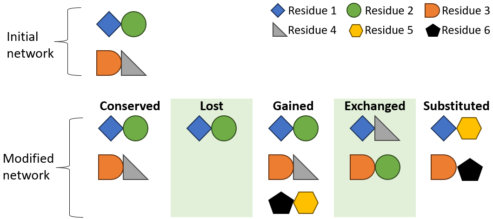

[User Guide home](Manual.md)
# Glossary 

This page ...

## Contact types

>[!WARNING]
> Don't confuse with [interaction types](#interaction-types).

Classification of residues in contact, close together but not necessarily in interaction, using their physico-chemical properties. As defined by [Vagone *et al.* (2015)](https://doi.org/10.7554/eLife.07454), the classification can be based on polar/apolar/charged (PAC) properties:

- Apolar-Apolar
- Apolar-Charged
- Apolar-Polar
- Charged-Charged
- Charged-Polar
- Polar-Polar

Or it can be based on hydrophobic/hydrophilic (HH) properties:

- Hydrophilic-Hydrophilic
- Hydrophilic-Hydrophobic
- Hydrophobic-Hydrophobic

## Interaction network

Here, an interaction network represents a motif consisting of residue pairs, their corresponding secondary structures, and the non-covalent interaction types between their atoms. Depending on the system being studied, an interaction network can either arise from the folding of a protein chain onto itself or from the interface between interacting protein chains.

## Interaction types

>[!WARNING]
> Don't confuse with [contact types](#contact-types).

Physico-chemical attraction or repulsion between amino acids. For more information, please look at the page: [Non-bonding interactions](__nonbonding_interactions.md)

## Repulsion & Clash

Repulsion and clash involve a pair of close residues with same charge or different hydropathy (hydrophile or hydrophobe).

**Repulsion:** If the distance between the backbones is close but the side chains are far apart, then repulsion occurs. The presence of a pepulsion is certainly not optimal, but is not necessarily an important bad factor for the protein-protein interaction.

**Clash:** If the distance between the backbones is close and the side chains are close, then there's a clash. The presence of a clash can be an important bad factor for the protein-protein interaction.

List of all repulsion/clash types:

- Anion-Anion
- Cation-Cation
- Hydrophobe-Hydrophophile

## Residues pairs types

No [interaction network](#interaction-network) is unchangeable, since variations are visible in the dynamics of any system. This is why we classified the residue pairs into five categories based on their presence in the initial and modified networks.

- **Conserved.** Pairs of residues that are present in both networks.
- **Exchanged.** The two residues forming the pair are already present in the initial network, but only interact in the modified network.
- **Gained.** Pairs of residues that are present in the modified network but not in the initial network. Finally, the use of these definitions introduces a very important concept: the transition from a network another is not necessarily equivalent.
- **Lost.** Pairs of residues that are present in the initial network but not in the modified network.
- **Substituted.** One of the two residues forming the pair is already present in the initial network, but the second is not.

