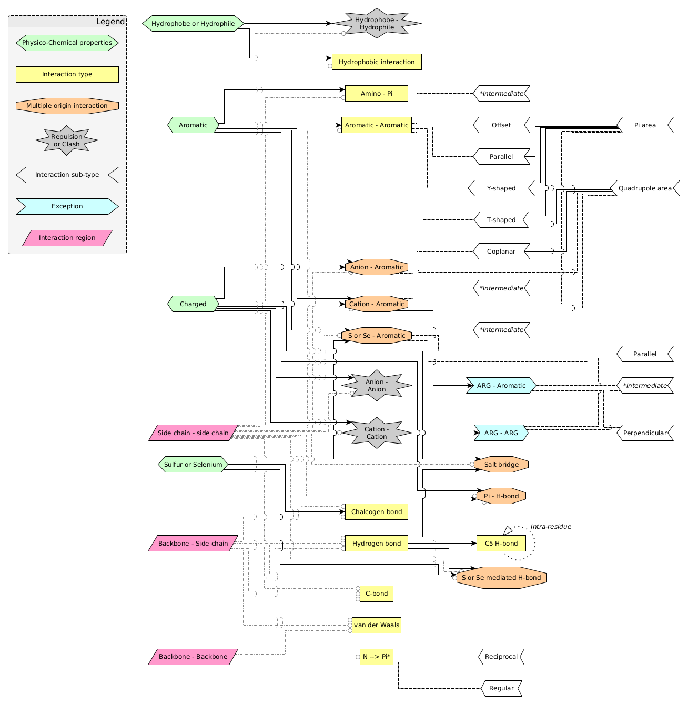
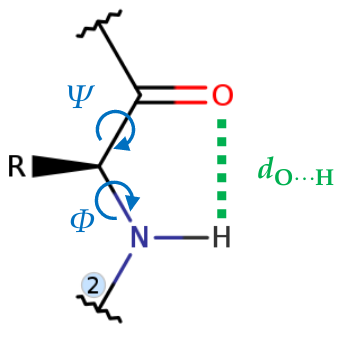
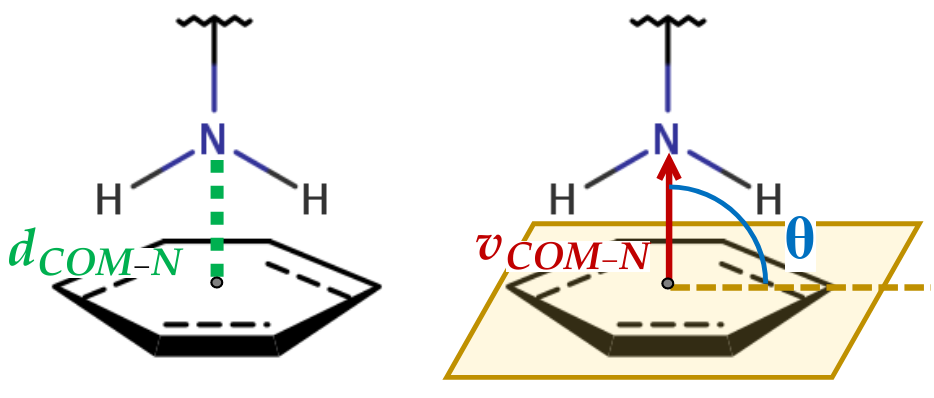
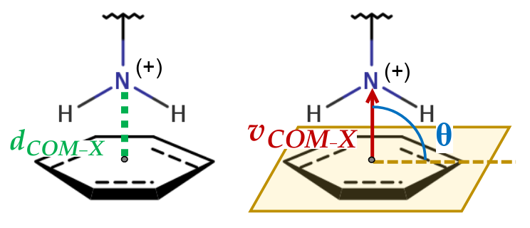
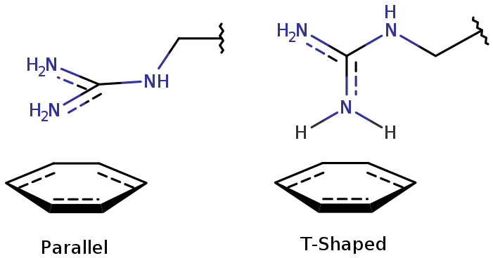

[User Guide home](Manual.md)

# Non-bonding interactions

This part explains all the geometric (distance, angle) and energetic (when available) parameters used to identify the types of interactions between two residues.

>[!NOTE]
>Remember that a pair of residues can establish diverse types of interactions, and that a single residue is capable of engaging in interactions with multiple others.

## A. Interaction regions

All amino acid can be devided into two region : backbone and side chain. It mean that any interaction can take place in this region, if the nature of the given interaction allows. As consequence it is possible to identify :

| Interaction region      | Description |
| ----------------------- | ----------- |
| Backbone - Backbone     | Interaction take place between the backbones of the tow residues. |
| Side chain - Side chain | Interaction take place between the side chains of the tow residues. |
| Backbone - Side chain   | Interaction take place between the backbone of one residue and the side chain of the other. |

## B. Side chaine of aromatig ring

Some interaction types can be specific to the aromatic area of the side chain. This one can be divided into 2 areas : $\pi$ and quadropole. The figure below illustrates the difference.

Considering the aromatic plane, the quadrupole are is conventionally identified bewteen $0˚ \leq \theta \leq 35˚$, while the $\pi$ are is identified between $60˚ \leq \theta ' \leq 90˚$.

> [!NOTE]
> An electrostatically driven interaction appears when the distance betwen the COM of the aromatic ring and a target (atom, or other COM of aromatic ring) is $d \leq 4.5$ Å.

## C. Relation between residue interaction types

Non-binding interactions are not to be considered independently, or in isolation from others. In fact, many types of interaction share identical physico-chemical properties. Likewise, their subtypes may share similar geometric organization.

*A hight quality version of this diagram can be fond in [PDF format](pictures/interaction_diagram.pdf), but it is not formated as A4 paper.*

>[!IMPORTANT]
>In this diagram and in the nomenclature used hereafter, the term **intermediate** designates an interaction between two residues whose subtype is not properly identified.
>
>- This may be due to rigid selection parameters. For example, if the limiting angle is 60.0˚ and the angle between the residues is 60.1°.
>- It's also possible that this is due to the structure not being fully relaxed, as can happen with crystal structures.
>- Finally, it may be due to the flexibility of the structure within which residues may have a slight mobility due to transient interaction between two subtypes.

## D. Remark concerning Histidine

Histidine can participate in $\pi-\pi$ stacking thank to its imidazole group, or in $\pi-$ anion ([Lucas *et al.*, 2016](https://doi.org/10.1039/c5sc01386k) and [Liao *et al.*, 2013](https://doi.org/10.1186/1752-153X-7-44)). In $\pi-$ cation, histidine can participate as a $\pi-$ system or as a cation when protonated: HIP/HSP ([Gallivan and Dougherty, 1999](https://doi.org/10.1073/pnas.96.17.9459)).

## E. Overview of interaction types

> [!NOTE]
> This is a general overview without too much detail. For detailed information of all parameters and subtypes [go below](#detailed-description-of-non-bonding-interactions) this table.

| Interaction type | Description | Energy (kcal/mol) | Distance (Å) | Angle (degree) |
| ---------------- | ----------- | ----------------- | ------------ | -------------- |
| $n \rightarrow \pi^*$ | Interaction between C and O of tow carbonyl group $(C=O)$ of the backbone: $C=O \cdots C=O$ | $-0.7 \leq E \leq -0.3$ | $d_{O\cdots C} \approx 3.0$ | $\widehat{OC\cdots O}\approx 102.0$ |
| C-bond | Interaction of $C^{sp3}$ (donnor) with carbonyl O (acceptor) through $n \rightarrow \sigma^*$ electron delocalization: $Z-C^{sp3} \cdots O=C$. Where *Z* is N, C or O. | $2.5 \leq d_{C \cdots O} \leq 3.6$ | $160 \leq \widehat{Z-C\cdots O}\leq 180$   $160 \leq \widehat{C\cdots O=C}\leq 180$ | Can be up to -4 |
| Chalcogen bond | [Chalcogen bond is a] net attractive interaction between an electrophilic region associated with a chalcogen atom in a molecular entity and a nucleophilic region in another, or the same, molecular entity. ([Aakeroy *et al.*, 2019](https://doi.org/10.1515/pac-2018-0713)) | Can be up to -3 | $d_{S/Se \cdots X} \leq 3.6$ | $\sigma \leq 50$   $30 \leq \Phi \leq 60$   $\theta \leq 50$   $115 \leq {CSX} \leq 155$ |
| S/Se mediated H-bond | Sulfur (S) or selenium (Se) are able to perform hydrogen bond and be a or hydorgen donor or hydorgen acceptor: $SH \cdots A$ or $S \cdots HD$ | S-mediated H-bond: $-5.5 \leq E \leq -4.5$   Se-mediated H-bond: Can be up to -7 | | $50 < \sigma$   $\widehat{CSX} \leq 145$ |
| Hydrogen bond | The hydrogen bond is an attractive interaction between a hydrogen atom from a molecule or amolecular fragment X–H in which X is more electronegative than H, and an atom or a group of atoms in the same or a different molecule, in which there is evidence of bond formation. [(Arunan *et al.*, 2011)](https://doi.org/10.1351/PAC-REC-10-01-02) | Can be up to -40 | $d_{D \cdots A} \leq 3$ | $120 \leq \widehat{DH \cdots A}$ |
| C5 H-bond | Intraresidue H-bond between carbonyl O and amino N atoms of the backbone.   $\phi$ is the backbone dihedral angle $\widehat{CNC_{\alpha}C'}$ and $\phi$ is the backbone dihedral angle $\widehat{NC_{\alpha}C'N'}$. | $E \approx -1.44$ | $d_{D \cdots A} \leq 2.7 $ | $\phi \approx 140$   $\psi \approx 140$ |
| $\pi -$ H bond | Interaction involving the $\pi$ part of an aromatic cycle and an hydrogen (H). | $-2.5 \leq E \leq -1.0$ | $d_{D \cdots C} \leq 5.5 $   $d_{H \cdots C} \leq 3 $   $d_{H_p \cdots C} \leq 1.2 $ | $\widehat{CHD} \geq 120$ |
| $\pi - \pi$ | Interaction between the $\pi$ part of two aromatic residues. | $E \approx -3$ | $d_{COM - COM} \leq 5.5 $ | $\theta_{planarity} \leq 30$ |
| $\pi -$ Quadrupole | Interaction between the $\pi$ part of one aromatic residue and the quadrupole part of another. |  | $d_{COM - COM} \leq 5.5 $ | $60 \leq \theta_{planarity}$ |
| Quadrupole - Quadrupole | Interaction between the quadrupole part of two aromatic residues. In this configuration the aromatic cycles are (approximatively) on the same plane. |  | $d_{COM - COM} \leq 5.5 $ | $\theta_{planarity} \leq 30$   $\theta_{plane_A-COM} \leq 35 $   $\theta_{plane_B-COM} \leq 35$ |
| Amino $- \pi$ | Interaction between the $\pi$ part of an aromatic cycle and the amino group of a ASN (ND2) or GLN (NE2). |  | $d_{COM-N} \leq 5.5 $ | $60 \leq \theta \leq 90$ |
| Aromatic - Charge | Positively and negatively charged amino acids can interact with the $\pi$ area or the quadrupole are of an aromatic cycle. | Quadrupole - Anion: Can be up to -8 | $d_{COM-X} \leq 5.5 $ | $60 \leq \theta$   or $\theta \leq 35$ |
| van der Waals | Noncovalent interactions (weak as compared to covalent bonds) due to dipole-induced dipole and dispersion forces acting at molecules and atoms. [(Minkin, 1999)](https://doi.org/10.1351/pac199971101919) |  | $radii_{vdw \space atom \space 1} + radii_{vdw \space atom \space 1} + N$ | No |
| Hydrophobic | Interaction between tow close hydrophobic residues. |  | $d_{COM-COM} \leq 5 $   $d_{CA-CA} \leq 9.5 $ |  |
| Hydrophobe - Hydrophile clash / repulsion | Proximity between a hydrophobic residue and a hydrophilic residue can lead to clash or a respustion, depending on their side chains COM-COM distance. |  | $d_{COM-COM} \leq 5 $   or $5 \leq d_{COM-COM} $ | No |
| Salt bridge | Strong electrostatic interaction involving an H-bond and an ionic bond between amino acids with opposite charges. |  | $d_{X \cdots X} \leq 4 $ |  |
| Charge clash / repulsion | Proximity between same charged residues can lead to clash or a respustion, depending on their side chains COM-COM distance. |  | $d_{X-X} \leq 5 $   or $5 \leq d_{X-X} $ | No |

# Detailed description of non-bonding interactions

##  1. $n \rightarrow \pi^*$

### 1.1. Description

Interaction between C and O of tow carbonyl group $(C=O)$ of the backbone:

**Representation :** $C=O \cdots C=O$

### 1.2. Geometric parameters

 Redraw from [Adhav *et al.* (2023)](https://doi.org/10.1021/acsomega.3c00205)

| Type| Value | Unit |
| --- | --- | --- |
| Distance | $d_{O\cdots C} \approx 3.0$ | Å |
| Angle    | $\widehat{OC\cdots O}\approx 102.0$ | degree |

### 1.3. Subtypes

 Redraw from [Adhav *et al.* (2023)](https://doi.org/10.1021/acsomega.3c00205)

### 1.4. Energy

$-0.7 \leq E \leq -0.3$ *kcal/mol*

##  2. C-bond

### 2.1. Description

Interaction of $C^{sp3}$ (donnor) with carbonyl O (acceptor) through $n \rightarrow \sigma^*$ electron delocalization. 

**Representation :** $Z-C^{sp3} \cdots O=C$   Where *Z* is N, C or O.

### 2.2. Geometric parameters

| Type| Value | Unit |
| --- | --- | --- |
| Distance | $2.5 \leq d_{C \cdots O} \leq 3.6$ | Å |
| Angle    | $160 \leq \widehat{Z-C\cdots O}\leq 180$ | degree |
| Angle    | $160 \leq \widehat{C\cdots O=C}\leq 180$ | degree |

### 2.3. Energy

- Can be up to -4 *kcal/mol*.

The dimerization energy ($D_0$) with zeropoint vibrational energy correction is calculated according to the formula of [Mundlapati *et al.*, 2018]( https://doi.org/10.1002/anie.201811171).
> [...] can be used to estimate the Z−C⋅⋅⋅O=C C-bond energy very precisely just by knowing the C⋅⋅⋅O distances. [...] The estimated C-bond energies in proteins are in the range of −2 to −22 kJ mol−1.

Values are in kJ/mol.

$$
D_0 = e^{ \ln(22.2) - 22.2 \times 10^6 \times e^{\frac{-d_{C\dots O}}{0.184}} } -22.2
$$

### 2.4. Carbon atoms involved in C-bond
$C^{sp3}$. is a carbon atom in a tetrahedral configuration; it is bonded to four other atoms (or groups) with single bonds [(Muller, P. , 1994)](https://doi.org/10.1351/pac199466051077). For example, the carbon in methan, formula: CH4 is a $C^{sp3}$.

| Amino acid    | $C^{sp3}$ atom names | Carbonyl oxygen |
| ------------- | -------------------- | --------------- |
| Backbone      | CA                   | O               |
| ALA           | CB                   | O               |
| ARG           | CB, CG, CD           | O               |
| ASN           | CB                   | O, OD1          |
| ASP           | CB                   | O, OD1          |
| CYS           | CB                   | O               |
| GLN           | CB, CG               | O, OE1          |
| GLU           | CB, CG               | O, OE1          |
| GLY           | *None*               | O               |
| HIS           | CB                   | O               |
| ILE           | CB, CG1, CG2, CD     | O               |
| LEU           | CB, CG, CD1, CD2     | O               |
| LYS           | CB, CG, CD, CE       | O               |
| MET           | CB, CG, CE           | O               |
| PHE           | CB                   | O               |
| PRO           | CB, CG, CD           | O               |
| SER           | CB                   | O               |
| THR           | CB, CG2              | O               |
| TRP           | CB                   | O               |
| TYR           | CB                   | O               |
| VAL           | CB, CG1, CG2         | O               |

##  3. Chalcogen bond & S/Se mediated H-bond

### 3.1. Description

#### 3.1.1. Chalcogen bond

> [Chalcogen bond is a] net attractive interaction between an electrophilic region associated with a chalcogen atom in a molecular entity and a nucleophilic region in another, or the same, molecular entity. ([Aakeroy *et al.*, 2019](https://doi.org/10.1515/pac-2018-0713))

S/Se of cystein/methionine interact with the oxygen of an carboxnl group: backbone (O), ASN (OD1), ASP (OD1), GLN (OE1), GLU (OE1), or the nitorgen (ND1) of HIS, or the $\pi$ area of aromatic residues.

#### 3.1.2. S/Se mediated H-bond

Sulfur (S) or selenium (Se) are able to perform hydrogen bond and be a or hydorgen donor or hydorgen acceptor.

**Representation (hydrogen donor):** $SH \cdots A$

**Representation (hydrogen acceptor):** $S \cdots HD$

#### 3.1.3. Segregate chalcogen bond and S/Se mediated H-bond

Perfect segregation between the chalcogen bond and the S/Se mediated H-bond is not obvious. The geometric parameters of the two can be quite close, for example there is an overlap of values for the $\widehat{CSX}$ angle. Here, the segregation will essentially take place with the value of the $\sigma$ dihedral angle.

### 3.2. Geometric parameters

Illustration of parameter used, with a sulfure atom as example. Parameters are the same for selenium.

- *X* : O or N atom.
- $a_1$, $a_2$ : Bonded atoms to S.
- $C_{a_1-a_2}$ : Centroid of the tree atoms $a_1$, $a_2$, S. *It is not the center of mass, but the geometric center.*
- $x'$ : Projection of the atom *X* on the plane defined by the tree atoms $a_1$, $a_2$, S.
- $d_{S \cdots X}$ : Distance between S and X.
- $\widehat{CSX}$  : Angle between the vectors $\overrightarrow{SC}$ and $\overrightarrow{SX}$.
- $\Phi$ : Angle between the vectors $\overrightarrow{CS}$ and $\overrightarrow{Sx'}$.
- $\theta$ : Angle between the normal vector of the plan and $\overrightarrow{SX}$.
- $\sigma$ : Dihedral angle between $\overrightarrow{aC}$, $\overrightarrow{CS}$ and $\overrightarrow{SX}$. It can be calculated as the angle between the planes *a,C,S* and *C,S,X*.

Parameters for chalcogen bonds:

| Type| Value | Unit |
| --- | --- | --- |
| Distance | $d_{S/Se \cdots X} \leq 3.6$ | Å |
| Angle    | $\sigma \leq 50$          | degree |
| Angle    | $30 \leq \Phi \leq 60$    | degree |
| Angle    | $\theta \leq 50$          | degree |
| Angle    | $115 \leq \widehat{CSX} \leq 155$ | degree |

Parameters for S/Se mediated H-bonds:

| Type| Value | Unit |
| --- | --- | --- |
| Angle | $50 < \sigma$    | degree |
| Angle | $\widehat{CSX} \leq 145$ | degree |

For sulfur, prefered angle are: $\widehat{DH \cdots S} \approx 141.1$ and $\widehat{SH \cdots A} \approx 136.5$

### 3.3. Energy

| Interaction | Energy |
| --- | --- |
| Chalcogen bond     | Can be up to -3 *kcal/mol* |
| S-mediated H-bond  | $-5.5 \leq E \leq -4.5$ *kcal/mol* |
| Se-mediated H-bond | Can be up to -7 *kcal/mol* |

##  4. Hydrogen bond

### 4.1. Description

> The hydrogen bond is an attractive interaction between a hydrogen atom from a molecule or amolecular fragment X–H in which X is more electronegative than H, and an atom or a group of atoms in the same or a different molecule, in which there is evidence of bond formation. [(Arunan *et al.*, 2011)](https://doi.org/10.1351/PAC-REC-10-01-02)

### 4.2. Geometric parameters

- *D*: Donor atom.
- *H*: Hydrogen atom.
- *A*: Acceptor atom.
- *A'*: Bonded atom to acceptor (A) atom.

| Type| Value | Unit |
| --- | --- | --- |
| Distance | $d_{D \cdots A} \leq 3 $   | Å |
| Angle | $120 \leq \widehat{DH \cdots A}$ | degree |

Diffrent method of identification are implemented in MDTraj:

- [Baker-Hubbard](https://mdtraj.org/1.9.7/api/generated/mdtraj.baker_hubbard.html)
- [Kabsch-Sander](https://mdtraj.org/1.9.7/api/generated/mdtraj.kabsch_sander.html)
- [Wernet-Nilsson](https://mdtraj.org/1.9.7/api/generated/mdtraj.wernet_nilsson.html)

### 4.3. Subtypes

| Interaction subtype | Distance $d_{D\cdots A}$ (Å) |
| ------------------- | ---------------------------- |
| Regular             | $d \geq 2.7$                 |
| Low barrier         | $2.4 \leq d \leq 2.6$        |
| Single-well         | $d < 2.3$                    |

### 4.4. Energy

Can be up to -40 *kcal/mol*

| Interaction subtype | Energy (*kcal/mol*) |
| ------------------- | ------------------- |
| Regular     | $-12 \leq E \leq -2.4$ |
| Low barrier | $-24 \leq E \leq -12$ |
| Single-well | $E \leq -24$ |

### 4.5. Atoms involved in H-bond

| Group      | Donor        | Acceptor    |
| ---------- | ------------ | ----------- |
| Backbone      | N            | O           |
| ARG           | NE, NH1, NH2 |             |
| ASN           | ND2          | OD1         |
| ASP           |              | OD1, OD2    |
| CYS           | SG           |             |
| CYS (SEC)     | SE           |             |
| CYS (CYH)     |              | SG (deprotonated) |
| CYS (???)     |              | SE (deprotonated) |
| GLN           | NE2          | OE1         |
| GLU           |              | OE1, OE2    |
| HIS           | ND1, NE2     | ND1, NE2, $\pi$ area |
| HIS (HSD/HID) | ND1          | NE2, $\pi$ area      |
| HIS (HSE/HIE) | NE2          | ND1, $\pi$ area      |
| HIS (HSP/HIP) | ND1, NE2     |             |
| LYS           | NZ           |             |
| MET           |              | SD          |
| MET (MSE)     |              | SE          |
| PHE           |              | $\pi$ area  |
| SER           | OG           | OG          |
| THR           | OG1          | OG1         |
| TRP           | NE1          | $\pi$ area  |
| TYR           | OH           | OH, $\pi$ area |

Modified from [IMGT website](https://www.imgt.org/IMGTeducation/Aide-memoire/_UK/aminoacids/charge/) and [old MDAnalysis guide](https://docs.mdanalysis.org/0.20.1/documentation_pages/analysis/hbond_analysis.html#id3).

>[!WARNING]
> Most identification methods only consider H-bonds involving O and N atoms as donor or acceptor. S/Se atoms and $\pi$ are not always considered.

### 4.6. Non-Canonical H-bonds

#### 4.6.1. Sulfur, or Selenium, mediated H-bond

See the section [3. Chalcogen bond & S/Se mediated H-bond](#3-chalcogen-bond--sse-mediated-h-bond)

#### 4.6.2. C5 H-bond

##### 4.6.2.1. Description

Intraresidue H-bond between carbonyl O and amino N atoms of the backbone.   $\phi$ is the backbone dihedral angle $\widehat{CNC_{\alpha}C'}$ and $\phi$ is the backbone dihedral angle $\widehat{NC_{\alpha}C'N'}$.

##### 4.6.2.2. Geometric parameters

| Type| Value | Unit |
| --- | --- | --- |
| Distance | $d_{D \cdots A} \leq 2.7 $  | Å |
| Angle | $\phi \approx 140$ | degree |
| Angle | $\psi \approx 140$ | degree |

##### 4.6.2.3. Energy

$E \approx -1.44$ *kcal/mol*

#### 4.6.2. $\pi - H$ bond

##### 4.6.2.1. Description
 
Interaction involving the $\pi$ part of an aromatic cycle and an hydrogen (H).

##### 4.6.2.2. Geometric parameters

- *D*: Hydrogen (H) donnor.
- *C*: Center of mass of aromatic C atoms.
- $H_p$: Projection of the H atom into the aromatic plane.

| Type| Value | Unit |
| --- | --- | --- |
| Distance | $d_{D \cdots C} \leq 5.5 $  | Å |
| Distance | $d_{H \cdots C} \leq 3 $  | Å |
| Distance | $d_{H_p \cdots C} \leq 1.2 $  | Å |
| Angle    | $\widehat{CHD} \geq 120$ | degree |

##### 4.6.2.3. Energy

$-2.5 \leq E \leq -1.0$ *kcal/mol*

##  5. Aromatic - Aromatic

### 5.0. Geometric parameters

Legend:

- *COM*: Center of mass of an aromatic cycle.
- *pCOM*: Point corresponting to the projection of COM of an aromatic cycle to the plane of the other aromatic cycle.
- $d_{COM-COM}$: Distance between the COM of each aromatic cycle.
- $v_{COM-COM}$: Vector passing through each aromatic COM.
- $v_{normal}$: Normal vector of the aromatic plane.
- $v_{COM-C}$: Vector passing through the COM and an aromatic carbon atom.
- $\theta_{plane-COM}$: Angle between the aromatic plane and the vector $v_{COM-COM}$. *Values range is 0-90.*
- $\theta_{shaped}$: Angle between vectors $v_{normal}$ and $v_{COM-C}$. *Values range is 0-90.*
- $\theta_{planarity}$: Angle between the two aromatic plane. *Values range is 0-90.*

>[!WARNING]
> Here, and everywhere in this documentation page, the aromatic COM is calculated only by selecting carbon atoms.

#### 5.0.1. Atoms use to determie aromatic plane

| Amino acid | Atoms defining aromatic plane|
| --- | --- |
| TYR | CG CD1 CD2 CE1 CE2 CZ | 
| TRP | CD2 CE2 CE3 CZ2 CZ3 CH2 | 
| PHE | CG CD1 CD2 CE1 CE2 CZ | 
| HIS | CG ND1 CD2 CE1 NE2 | 
| HID | CG ND1 CD2 CE1 NE2 | 
| HIE | CG ND1 CD2 CE1 NE2 | 
| HSD | CG ND1 CD2 CE1 NE2 | 
| HSE | CG ND1 CD2 CE1 NE2 | 

### 5.1. $\pi - \pi$ : Parallel & Offset

#### 5.1.1. Description

**Synonym:** *Offset* is also call *Displaced*

Interaction between the $\pi$ part of two aromatic residues.

#### 5.1.2. Geometric parameters

##### 5.1.2.1. Parallel

| Type | Value | Unit |
| ---- | --- | --- |
| Distance | $d_{COM - COM} \leq 5.5 $  | Å |
| Distance | $d_{COM - pCOM} < 1.6 $  | Å |
| Angle | $\theta_{planarity} \leq 30$ | Degree |
| Angle | $60 \leq \theta_{plane_A-COM}$   $60 \leq \theta_{plane_B-COM}$ | Degree |

##### 5.1.2.2. Offset

| Type | Value | Unit |
| ---- | --- | --- |
| Distance | $d_{COM - COM} \leq 5.5 $  | Å |
| Distance | $1.6 \leq d_{COM - pCOM} \leq 2.0 $  | Å |
| Angle | $\theta_{planarity} \leq 30$ | Degree |
| Angle | $60 \leq \theta_{plane_A-COM}$   $60 \leq \theta_{plane_B-COM}$ | Degree |

#### 5.1.3. Energy

$E \approx -3$ *kcal/mol*

### 5.2. $\pi -$ Quadrupole : T-shaped & Y-shaped

#### 5.2.1. Description

Interaction between the $\pi$ part of one aromatic residue and the quadrupole part of another.

#### 5.2.2. Geometric parameters

##### 5.2.2.1. T-shaped

| Type | Value | Unit |
| ---- | --- | --- |
| Distance | $d_{COM - COM} \leq 5.5 $ | Å |
| Angle | $\theta_{plane_B-COM} \leq 35$ | Degree |
| Angle | $60 \leq \theta_{plane_A-COM}$ | Degree |
| Angle | $60 \leq \theta_{planarity}$   | Degree |
| Angle | $\theta_{shaped} \leq 5 $ | Degree |

##### 5.2.2.2. Y-shaped

| Type | Value | Unit |
| ---- | --- | --- |
| Distance | $d_{COM - COM} \leq 5.5 $ | Å |
| Angle | $\theta_{plane_B-COM} \leq 35$ | Degree |
| Angle | $60 \leq \theta_{plane_A-COM}$ | Degree |
| Angle | $60 \leq \theta_{planarity}$   | Degree |
| Angle | $5 < \theta_{shaped}$ | Degree |

### 5.3. Quadrupole - Quadrupole

#### 5.3.1. Description

**Synonym:** Coplanar

Interaction between the quadrupole part of two aromatic residues. In this configuration the aromatic cycles are (approximatively) on the same plane.

#### 5.3.2. Geometric parameters

| Type | Value | Unit |
| ---- | --- | --- |
| Distance | $d_{COM - COM} \leq 5.5 $ | Å |
| Angle | $\theta_{planarity} \leq 30$ | Degree |
| Angle | $\theta_{plane_A-COM} \leq 35 $   $\theta_{plane_B-COM} \leq 35$ | Degree |

>[!IMPORTANT]
>If $d_{COM - COM} \leq 5.5 $ but other parameters do not correspond to those written previously the interaction is called *intermediate*.

##  6. Amino $- \pi$

### 6.1. Description

Interaction between the $\pi$ part of an aromatic cycle and the amino group of a ASN (ND2) or GLN (NE2).

### 6.2. Geometric parameters

Legend:

- $d_{COM-N}$: Distance between the aromatic COM and the nitorgen (ND2 or NE2).
- $v_{COM-N}$: Vector between the aromatic COM and the nitorgen (ND2 or NE2).
- $\theta$: Angle between the $v_{COM-N}$ and the aromatic plane$. *Values range is 0-90.*

| Type | Value | Unit |
| ---- | --- | --- |
| Distance | $d_{COM-N} \leq 5.5 $ | Å |
| Angle | $60 \leq \theta \leq 90$ | Degree |

##  7. Aromatic - Charge

### 7.1. Description

Positively and negatively charged amino acids can interact with the $\pi$ area or the quadrupole are of an aromatic cycle.

Below an illustration showing the interaction between one aromatic cycle and a negatively charged side chain.

### 7.2. Geometric parameters

*For more visibility, one hydrogen (H) of the charged side chain is not shown, and the charge symbol has been shifted.*

Legend:

- *X atom*: Atom use as reference for the charge. It is ammonium nitrogen (NZ) of the LYS, the guanidinium carbon (CZ) of the ARG, the protonated nitrogen (ND1) in the imidazol group of HIP, the carboxyl carbon (CG) of the ASP or (CD) of the GLU.
- $d_{COM-X}$: The distance is measured between between the X atom and the COM of the aromatic ring.
- $v_{COM-X}$: Vector between the COM of the aromatic ring and the X atom.
- $\theta$: Angle between the vector $v_{COM-X}$ and the plane of the aromatic cycle. *Values range is 0-90.*

#### 7.2.1. $\pi -$ Charge

| Type | Value | Unit |
| ---- | --- | --- |
| Distance | $d_{COM-X} \leq 5.5 $ | Å |
| Angle | $60 \leq \theta$ | Degree |

#### 7.2.2. Quadrupole - Charge

| Type | Value | Unit |
| ---- | --- | --- |
| Distance | $d_{COM-X} \leq 5.5 $ | Å |
| Angle | $\theta \leq 35$ | Degree |

### 7.3. Energy

Quadrupole - Anion: Can be up to -8 *kcal/mol*

### 7.4. Subtypes

- $\pi - $ Cation
- $\pi - $ Anion
- Quadrupole - Cation
- Quadrupole - Anion

### 7.5. Special cases of Arginine

#### 7.5.1. Geometric parameters

Legend:

- Arg plane: Plane defined by the NE, NH1, NH2 atoms.
- $v_{normal-arg}$: Normale vector of the Arg plane.
- $v_{normal-aromatic}$: Normale vector of the aromatic plane.
- $\theta$: Angle between the two vectors $v_{normal-arg}$ and $v_{normal-aromatic}$.

| | Type | Value | Unit |
| --- | ---- | --- | --- |
| Parallel | Angle | $\theta \leq 35$ | Degree |
| Perpendicular | Angle | $60 \leq \theta$ | Degree |

##  8. van der Waals

### 8.1. Description

>Noncovalent interactions (weak as compared to covalent bonds) due to dipole-induced dipole and dispersion forces acting at molecules and atoms. [(Minkin, 1999)](https://doi.org/10.1351/pac199971101919) 

### 8.2. Geometric parameters

Use the sum of the vander waals radius of both atoms plus a constant N, where N is in the range 0 Å to 0.6 Å :

$$
radii_{vdw \space atom \space 1} + radii_{vdw \space atom \space 1} + N
$$

All values for van der Waals radii can be found in the [Element properties](__element_properties.md) page.

### 8.4. Subtypes

Their is not properly wdW subtypes but contacts because the identification is based only using distances. But is is possible to categorize diffrents [contact types](__glossary.md#contact-types) using amino acid properties.

##  9. Hydrophobic interaction

### 9.1. Description

Interaction between tow close hydrophobic residues.

### 9.2. Geometric parameters

Distances between the CA atoms and the COMs of the side chains.

| Type | Value | Unit |
| ---- | --- | --- |
| Distance | $d_{COM-COM} \leq 5 $ | Å |
| Distance | $d_{CA-CA} \leq 9.5 $ | Å |

## 10. Hydrophobe - Hydrophile clash / repulsion

### 10.1. Description

Proximity between a hydrophobic residue and a hydrophilic residue can lead to clash or a respustion, depending on their side chains COM-COM distance.

### 10.2. Geometric parameters

Distances between the CA atoms and the COMs of the side chains.

### 10.2.1. Clash

| Type | Value | Unit |
| ---- | --- | --- |
| Distance | $d_{COM-COM} \leq 5 $ | Å |
| Distance | $d_{CA-CA} \leq 9.5 $ | Å |

### 10.2.2. Repulsion

| Type | Value | Unit |
| ---- | --- | --- |
| Distance | $5 \leq d_{COM-COM} $ | Å |
| Distance | $d_{CA-CA} \leq 9.5 $ | Å |

##  11. Salt bridge

### 11.1. Description

Strong electrostatic interaction involving an H-bond and an ionic bond between amino acids with opposite charges.

 *Simplified scheme for ionic bond.* 

### 11.2. Geometric parameters

For the H-bond part, please take look at [4. Hydrogen bond](#4-hydrogen-bond).

| Residue | Charge | Charge location (*Not charged atoms*) | Atoms able to perform H-bond |
| ------- | ------ | --- | --- |
| LYS     | +      | NZ  | NZ HZ1 HZ2 HZ3 |
| ARG     | +      | CZ  | HE NE NH1 HH11 HH12 NH2 HH21 HH22 |
| HIP     | +      | ND1 | ND1 NE2 HE2 HD1 |
| HSP     | +      | ND1 | ND1 NE2 HE2 HD1 |
| ASP     | -      | CG  | OD1 OD2 HD2 |
| GLU     | -      | CD  | OE1 OE2 HE2 |

- *X atom*: Atom use as charge location, see table above.
- $d_{CA - CA}$: Distance between CA atoms.
- $d_{X \cdots X}$: Distance between the *X* atoms.
- $d_{D \cdots A}$: Distance between hydrogen donnor and acceptor.
- $\widehat{DH \cdots A}$: Angle

| Type | Value | Unit |
| ---- | --- | --- |
| Distance | $d_{CA - CA} \leq 13$ | Å |
| Distance | $d_{X \cdots X} \leq 4 $ | Å |
| Distance | $d_{D \cdots A} \leq 3 $   | Å |
| Angle | $120 \leq \widehat{DH \cdots A}$ | degree |

##  12. Charge clash / repulsion

### 12.1. Description

Proximity between same charged residues can lead to clash or a respustion, depending on their side chains COM-COM distance.

### 12.2. Geometric parameters

Distances between the CA atoms and the *X* atoms.

For more information concerning charges (*X* atoms), please see [11. Salt bridge](#11-salt-bridge).

### 12.2.1. Clash

| Type | Value | Unit |
| ---- | --- | --- |
| Distance | $d_{X-X} \leq 5 $ | Å |
| Distance | $d_{CA-CA} \leq 13 $ | Å |

### 12.2.2. Repulsion

| Type | Value | Unit |
| ---- | --- | --- |
| Distance | $5 \leq d_{X-X} $ | Å |
| Distance | $d_{CA-CA} \leq 13 $ | Å |

### 12.3. Subtypes

- Cation - Cation
- Anion - Anion

### 12.4. Special cases of Arginine

#### 12.4.1. Description

Arginine can stack with another arginine. Technically this corresponds to a charge collision, but this specific case is stable and can favor the protein-protein interaction.

 

#### 12.4.2. Geometric parameters

Legend:

- $d_{CZ \cdots CZ}$: Distance between the CZ atoms.
- Arg plane: Plane defined by the NE, NH1, NH2 atoms.
- $\theta$: Angle between the tow Arg planes.

##### 12.4.2.1. Parallel

| Type | Value | Unit |
| ---- | --- | --- |
| Distance | $d_{CZ \cdots CZ} \leq 6 $ | Å |
| Angle    | $\theta \leq 35 $ | degree |

##### 12.4.2.2. Perpendicular

| Type | Value | Unit |
| ---- | --- | --- |
| Distance | $d_{CZ \cdots CZ} \leq 6 $ | Å |
| Angle    | $60 \leq \theta $ | degree |

<!--- --->
# References

## R.1. General

- Adhav, V. A. & Saikrishnan, K. The Realm of Unconventional Noncovalent Interactions in Proteins: Their Significance in Structure and Function. *ACS Omega* 8, 22268–22284 (2023). [https://doi.org/10.1021/acsomega.3c00205](https://doi.org/10.1021/acsomega.3c00205)
- Protein interactions: the molecular basis of interactomics. (Wiley-VCH, 2023). ISBN: [978-3-527-83052-7](https://www.wiley.com/en-us/Protein+Interactions:+The+Molecular+Basis+of+Interactomics-p-9783527830527)
- Minkin, V. I. Glossary of terms used in theoretical organic chemistry. *Pure and Applied Chemistry* 71, 1919–1981 (1999). [https://doi.org/10.1351/pac199971101919](https://doi.org/10.1351/pac199971101919)
- Muller, P. Glossary of terms used in physical organic chemistry (IUPAC Recommendations 1994). *Pure and Applied Chemistry* 66, 1077–1184 (1994). [https://doi.org/10.1351/pac199466051077](https://doi.org/10.1351/pac199466051077)
- Řezáč, J. Non-Covalent Interactions Atlas. [http://www.nciatlas.org/index.html](http://www.nciatlas.org/index.html)
	- Řezáč, J. Non-Covalent Interactions Atlas Benchmark Data Sets: Hydrogen Bonding. *J. Chem. Theory Comput.* 16, 2355–2368 (2020). [https://doi.org/10.1021/acs.jctc.9b01265](https://doi.org/10.1021/acs.jctc.9b01265)
	- Řezáč, J. Non-Covalent Interactions Atlas Benchmark Data Sets 2: Hydrogen Bonding in an Extended Chemical Space. *J. Chem. Theory Comput.* 16, 6305–6316 (2020). [https://doi.org/10.1021/acs.jctc.0c00715](https://doi.org/10.1021/acs.jctc.0c00715)
	- Kříž, K., Nováček, M. & Řezáč, J. Non-Covalent Interactions Atlas Benchmark Data Sets 3: Repulsive Contacts. *J. Chem. Theory Comput.* 17, 1548–1561 (2021). [https://doi.org/10.1021/acs.jctc.0c01341](https://doi.org/10.1021/acs.jctc.0c01341)
	- Kříž, K. & Řezáč, J. Non-covalent interactions atlas benchmark data sets 4: σ-hole interactions. *Phys. Chem. Chem. Phys.* 24, 14794–14804 (2022). [https://doi.org/10.1039/D2CP01600A](https://doi.org/10.1039/D2CP01600A)
	- Řezáč, J. Non-Covalent Interactions Atlas benchmark data sets 5: London dispersion in an extended chemical space. *Phys. Chem. Chem. Phys.* 24, 14780–14793 (2022). [https://doi.org/10.1039/D2CP01602H ](https://doi.org/10.1039/D2CP01602H )
- ~~Hou, Q., Bourgeas, R., Pucci, F. & Rooman, M. Computational analysis of the amino acid interactions that promote or decrease protein solubility. *Sci Rep* 8, 14661 (2018). [https://doi.org/10.1038/s41598-018-32988-w](https://doi.org/10.1038/s41598-018-32988-w)~~

## R.2. Hydrogen bond

- Arunan, E. et al. Definition of the hydrogen bond (IUPAC Recommendations 2011). *Pure and Applied Chemistry* 83, 1637–1641 (2011).[https://doi.org/10.1351/PAC-REC-10-01-02](https://doi.org/10.1351/PAC-REC-10-01-02)
- McDonald, I. & Thornton, J. M. Atlas of Side-Chain and Main-Chain Hydrogen Bonding. [https://web.archive.org/web/20030811125954/http://www.biochem.ucl.ac.uk/~mcdonald/atlas/](https://web.archive.org/web/20030811125954/http://www.biochem.ucl.ac.uk/~mcdonald/atlas/) (1994).
	- McDonald, I. K. & Thornton, J. M. Satisfying Hydrogen Bonding Potential in Proteins. *Journal of Molecular Biology* 238, 777–793 (1994). [https://doi.org/10.1006/jmbi.1994.1334](https://doi.org/10.1006/jmbi.1994.1334)

### R.2.1. Water mediated H-bond

- Petukhov, M., Rychkov, G., Firsov, L. & Serrano, L. H‐bonding in protein hydration revisited. *Protein Science* 13, 2120–2129 (2004). [https://doi.org/10.1110/ps.04748404](https://doi.org/10.1110/ps.04748404)

### R.2.2. $\pi -$ hydrogen bond 

- Wang, J. & Yao, L. Dissecting C−H∙∙∙π and N−H∙∙∙π Interactions in Two Proteins Using a Combined Experimental and Computational Approach. *Sci Rep* 9, 20149 (2019). [https://doi.org/10.1038/s41598-019-56607-4](https://doi.org/10.1038/s41598-019-56607-4)

### R.2.3. C5 H-bond

- Mundlapati, V. R. et al. N–H⋯X interactions stabilize intra-residue C5 hydrogen bonded conformations in heterocyclic α-amino acid derivatives. *Chem. Sci.* 12, 14826–14832 (2021). [https://doi.org/10.1039/D1SC05014A ](https://doi.org/10.1039/D1SC05014A )
- Kumar, S. et al. Observation of a weak intra-residue C5 hydrogen-bond in a dipeptide containing Gly-Pro sequence. *The Journal of Chemical Physics* 151, 104309 (2019). [https://doi.org/10.1063/1.5115040](https://doi.org/10.1063/1.5115040)
- Newberry, R. W. & Raines, R. T. A prevalent intraresidue hydrogen bond stabilizes proteins. *Nat Chem Biol* 12, 1084–1088 (2016). [https://doi.org/10.1038/nchembio.2206](https://doi.org/10.1038/nchembio.2206)

## R.3. Aromatic involved interactions

- Cabaleiro-Lago, E. M. & Rodríguez-Otero, J. On the Nature of σ–σ, σ–π, and π–π Stacking in Extended Systems. *ACS Omega* 3, 9348–9359 (2018). [https://doi.org/10.1021%2Facsomega.8b01339](https://doi.org/10.1021%2Facsomega.8b01339)
- Martinez, C. R. & Iverson, B. L. Rethinking the term “pi-stacking”. *Chem. Sci.* 3, 2191 (2012). [https://doi.org/10.1039/C2SC20045G](https://doi.org/10.1039/C2SC20045G)
- Carter-Fenk, K. & Herbert, J. M. Electrostatics does not dictate the slip-stacked arrangement of aromatic π–π interactions. *Chem. Sci.* 11, 6758–6765 (2020). [https://doi.org/10.1039/D0SC02667K](https://doi.org/10.1039/D0SC02667K)
- Jin, M. Y. et al. Engineered non-covalent π interactions as key elements for chiral recognition. *Nat Commun* 13, 3276 (2022). [https://doi.org/10.1038/s41467-022-31026-8](https://doi.org/10.1038/s41467-022-31026-8)
- Brocchieri, L. & Karlin, S. Geometry of interplanar residue contacts in protein structures. *Proc. Natl. Acad. Sci. U.S.A.* 91, 9297–9301 (1994). [https://doi.org/10.1073/pnas.91.20.9297](https://doi.org/10.1073/pnas.91.20.9297)
- Dalkas, G. A., Teheux, F., Kwasigroch, J. M. & Rooman, M. Cation–π, amino–π, π–π, and H‐bond interactions stabilize antigen–antibody interfaces. *Proteins* 82, 1734–1746 (2014). [https://doi.org/10.1002/prot.24527](https://doi.org/10.1002/prot.24527)

### R.3.1. Cation $- \pi$

- Crowley, P. B. & Golovin, A. Cation–π interactions in protein–protein interfaces. *Proteins* 59, 231–239 (2005). [https://doi.org/10.1002/prot.20417](https://doi.org/10.1002/prot.20417)
- Dougherty, D. A. The Cation−π Interaction. *Acc. Chem. Res.* 46, 885–893 (2013). [https://doi.org/10.1021/ar300265y](https://doi.org/10.1021/ar300265y)
- Mahadevi, A. S. & Sastry, G. N. Cation−π Interaction: Its Role and Relevance in Chemistry, Biology, and Material Science. *Chem. Rev.* 113, 2100–2138 (2013). [https://doi.org/10.1021/cr300222d](https://doi.org/10.1021/cr300222d)
- Gallivan, J. P. & Dougherty, D. A. Cation-π interactions in structural biology. *Proc. Natl. Acad. Sci. U.S.A.* 96, 9459–9464 (1999). [https://doi.org/10.1073/pnas.96.17.9459](https://doi.org/10.1073/pnas.96.17.9459)

### R.3.2. Anion $- \pi$

- Lucas, X., Bauzá, A., Frontera, A. & Quiñonero, D. A thorough anion–π interaction study in biomolecules: on the importance of cooperativity effects. *Chem. Sci.* 7, 1038–1050 (2016). [https://doi.org/10.1039/C5SC01386K](https://doi.org/10.1039/C5SC01386K)
- Schottel, B. L., Chifotides, H. T. & Dunbar, K. R. Anion-π interactions. *Chem. Soc. Rev.* 37, 68–83 (2008). [https://doi.org/10.1039/B614208G](https://doi.org/10.1039/B614208G)
- Chakravarty, S., Ung, A. R., Moore, B., Shore, J. & Alshamrani, M. A Comprehensive Analysis of Anion–Quadrupole Interactions in Protein Structures. *Biochemistry* 57, 1852–1867 (2018). [https://doi.org/10.1021/acs.biochem.7b01006](https://doi.org/10.1021/acs.biochem.7b01006)

### R.3.3. HIS involved

- Liao, S.-M., Du, Q.-S., Meng, J.-Z., Pang, Z.-W. & Huang, R.-B. The multiple roles of histidine in protein interactions. *Chemistry Central Journal* 7, 44 (2013). [https://doi.org/10.1186/1752-153X-7-44](https://doi.org/10.1186/1752-153X-7-44)
- Heyda, J., Mason, P. E. & Jungwirth, P. Attractive Interactions between Side Chains of Histidine-Histidine and Histidine-Arginine-Based Cationic Dipeptides in Water. *J. Phys. Chem. B* 114, 8744–8749 (2010). [https://doi.org/10.1021/jp101031v](https://doi.org/10.1021/jp101031v)

## R.4. Charge involved interactions (excluding $\pi-$ interactions)

### R.4.1. Salt bridge

- Kumar, S. & Nussinov, R. Close-Range Electrostatic Interactions in Proteins. ChemBioChem 3, 604 (2002). [https://doi.org/10.1002/1439-7633(20020703)3:7<604::AID-CBIC604>3.0.CO;2-X](https://doi.org/10.1002/1439-7633(20020703)3:7<604::AID-CBIC604>3.0.CO;2-X)
- Ferreira De Freitas, R. & Schapira, M. A systematic analysis of atomic protein–ligand interactions in the PDB. *Med. Chem. Commun.* 8, 1970–1981 (2017). [https://doi.org/10.1039/C7MD00381A](https://doi.org/10.1039/C7MD00381A)
- Donald, J. E., Kulp, D. W. & DeGrado, W. F. Salt bridges: Geometrically specific, designable interactions. *Proteins* 79, 898–915 (2011). [https://doi.org/10.1002/prot.22927](https://doi.org/10.1002/prot.22927)
- Pylaeva, S., Brehm, M. & Sebastiani, D. Salt Bridge in Aqueous Solution: Strong Structural Motifs but Weak Enthalpic Effect. *Sci Rep* 8, 13626 (2018). [https://doi.org/10.1038/s41598-018-31935-z](https://doi.org/10.1038/s41598-018-31935-z)

### R.4.2.  ARG-ARG stacking

- Lee, D., Lee, J. & Seok, C. What stabilizes close arginine pairing in proteins? *Phys. Chem. Chem. Phys.* 15, 5844 (2013). [https://doi.org/10.1039/C3CP00160A](https://doi.org/10.1039/C3CP00160A)
- Magalhaes, A., Maigret, B., Hoflack, J., Gomes, J. N. F. & Scheraga, H. A. Contribution of unusual Arginine-Arginine short-range interactions to stabilization and recognition in proteins. *J Protein Chem* 13, 195–215 (1994). [https://doi.org/10.1007/BF01891978](https://doi.org/10.1007/BF01891978)

### R.4.3. Charge-Charge repulsion

- Norouzy, A., Assaf, K. I., Zhang, S., Jacob, M. H. & Nau, W. M. Coulomb Repulsion in Short Polypeptides. *J. Phys. Chem. B* 119, 33–43 (2015). [https://doi.org/10.1021/jp508263a](https://doi.org/10.1021/jp508263a)

## R.5. van der Waals

- Mantina, M., Valero, R., Cramer, C. J. & Truhlar, D. G. Atomic radii of the elements. in *CRC Handbook of chemistry and physics* (eds. Haynes, W. M., Lide, D. R. & Bruno, T. J.) 9–57 (CRC Press, 2016). [https://doi.org/10.1201/9781315380476](https://doi.org/10.1201/9781315380476)
- Tsai, J., Taylor, R., Chothia, C. & Gerstein, M. The packing density in proteins: standard radii and volumes 1 1Edited by J. M. Thornton. *Journal of Molecular Biology* 290, 253–266 (1999). [https://doi.org/10.1006/jmbi.1999.2829](https://doi.org/10.1006/jmbi.1999.2829)
- Meng, E. C. & Lewis, R. A. Determination of molecular topology and atomic hybridization states from heavy atom coordinates. *J Comput Chem* 12, 891–898 (1991). [https://doi.org/10.1002/jcc.540120716]( https://doi.org/10.1002/jcc.540120716)
- Li, A.-J. & Nussinov, R. A set of van der Waals and coulombic radii of protein atoms for molecular and solvent-accessible surface calculation, packing evaluation, and docking. *Proteins* 32, 111–127 (1998). [https://doi.org/10.1002/(SICI)1097-0134(19980701)32:1<111::AID-PROT12>3.0.CO;2-H](https://doi.org/10.1002/(SICI)1097-0134(19980701)32:1<111::AID-PROT12>3.0.CO;2-H)

## R.6. $\sigma-$ hole

### R.6.1. Carbon bond (C-bond)

- Mundlapati, V. R. et al. Noncovalent Carbon‐Bonding Interactions in Proteins. *Angew Chem Int Ed* 57, 16496–16500 (2018). [https://doi.org/10.1002/anie.201811171]( https://doi.org/10.1002/anie.201811171)

### R.6.2. Chalcogen bond

- Aakeroy, C. B. et al. Definition of the chalcogen bond (IUPAC Recommendations 2019). *Pure and Applied Chemistry* 91, 1889–1892 (2019). [https://doi.org/10.1515/pac-2018-0713](https://doi.org/10.1515/pac-2018-0713)
- Pal, D. & Chakrabarti, P. Non-hydrogen Bond Interactions Involving the Methionine Sulfur Atom. *Journal of Biomolecular Structure and Dynamics* 19, 115–128 (2001). [https://doi.org/10.1080/07391102.2001.10506725](https://doi.org/10.1080/07391102.2001.10506725)
- Kong, X., Zhou, P. & Wang, Y. Chalcogen⋅⋅⋅π Bonding Catalysis. *Angewandte Chemie* 133, 9481–9486 (2021). [https://doi.org/10.1002/ange.202101140](https://doi.org/10.1002/ange.202101140)
- Carugo, O., Resnati, G. & Metrangolo, P. Chalcogen Bonds Involving Selenium in Protein Structures. *ACS Chem. Biol.*  16, 1622–1627 (2021). [https://doi.org/10.1021/acschembio.1c00441](https://doi.org/10.1021/acschembio.1c00441)
- Scheiner, S. Participation of S and Se in hydrogen and chalcogen bonds. *CrystEngComm* 23, 6821–6837 (2021). [https://doi.org/10.1039/D1CE01046H](https://doi.org/10.1039/D1CE01046H)
- Adhav, V. A., Shelke, S. S., Balanarayan, P. & Saikrishnan, K. Sulfur-mediated chalcogen versus hydrogen bonds in proteins: a see-saw effect in the conformational space. *QRB Discovery* 4, e5 (2023). [https://doi.org/10.1017/qrd.2023.3 ](https://doi.org/10.1017/qrd.2023.3 )

## R.7. Hydrophobic interaction

- Onofrio, A. et al. Distance-dependent hydrophobic–hydrophobic contacts in protein folding simulations. *Phys. Chem. Chem. Phys.* 16, 18907–18917 (2014). [https://doi.org/10.1039/C4CP01131G](https://doi.org/10.1039/C4CP01131G)

## R.8. Non-bonding involving Sulfur and Selenium

- Kojasoy, V. & Tantillo, D. J. Impacts of noncovalent interactions involving sulfur atoms on protein stability, structure, folding, and bioactivity. *Org. Biomol. Chem.* 21, 11–23 (2023). [https://doi.org/10.1039/D2OB01602H](https://doi.org/10.1039/D2OB01602H)

### R.8.1 Sulfur/Selenium - Aromatic

- Ringer, A. L., Senenko, A. & Sherrill, C. D. Models of S/π interactions in protein structures: Comparison of the H 2 S–benzene complex with PDB data. *Protein Science* 16, 2216–2223 (2007). [https://doi.org/10.1110/ps.073002307](https://doi.org/10.1110/ps.073002307)
- Pal, D. & Chakrabarti, P. Non-hydrogen Bond Interactions Involving the Methionine Sulfur Atom. *Journal of Biomolecular Structure and Dynamics* 19, 115–128 (2001). [https://doi.org/10.1080/07391102.2001.10506725](https://doi.org/10.1080/07391102.2001.10506725)
- Senćanski, M., Djordjević, I. & Grubišić, S. Assessing the dispersive and electrostatic components of the selenium–aromatic interaction energy by DFT. *J Mol Model* 23, 162 (2017). [https://doi.org/10.1007/s00894-017-3330-z](https://doi.org/10.1007/s00894-017-3330-z)
- Hartman, I., Raia, C. A. & Zauhar, R. J. Evidence for a strong selenium–aromatic interaction derived from crystallographic data and ab initio quantum chemical calculations. *Biopolymers* 83, 595–613 (2006). [https://doi.org/10.1002/bip.20592]( https://doi.org/10.1002/bip.20592)

### R.8.2. Sulfur/Selenium mediated H-bond

- Antonijević, I. S., Janjić, Goran. V., Milčić, M. K. & Zarić, S. D. Preferred Geometries and Energies of Sulfur–Sulfur Interactions in Crystal Structures. *Crystal Growth & Design* 16, 632–639 (2016). [https://doi.org/10.1021/acs.cgd.5b01058](https://doi.org/10.1021/acs.cgd.5b01058)
- Gregoret, L. M., Rader, S. D., Fletterick, R. J. & Cohen, F. E. Hydrogen bonds involving sulfur atoms in proteins. *Proteins* 9, 99–107 (1991). [https://doi.org/10.1002/prot.340090204](https://doi.org/10.1002/prot.340090204)
- Mishra, K. K., Singh, S. K., Ghosh, P., Ghosh, D. & Das, A. The nature of selenium hydrogen bonding: gas phase spectroscopy and quantum chemistry calculations. *Phys. Chem. Chem. Phys.* 19, 24179–24187 (2017). [https://doi.org/10.1039/C7CP05265K ](https://doi.org/10.1039/C7CP05265K)
- Chand, A., Sahoo, D. K., Rana, A., Jena, S. & Biswal, H. S. The Prodigious Hydrogen Bonds with Sulfur and Selenium in Molecular Assemblies, Structural Biology, and Functional Materials. *Acc. Chem. Res.* 53, 1580–1592 (2020). [https://doi.org/10.1021/acs.accounts.0c00289](https://doi.org/10.1021/acs.accounts.0c00289)
- Mishra, K. K. et al. Water-Mediated Selenium Hydrogen-Bonding in Proteins: PDB Analysis and Gas-Phase Spectroscopy of Model Complexes. *J. Phys. Chem. A* 123, 5995–6002 (2019). [https://doi.org/10.1021/acs.jpca.9b04159](https://doi.org/10.1021/acs.jpca.9b04159)
- Wilds, C. J., Pattanayek, R., Pan, C., Wawrzak, Z. & Egli, M. Selenium-Assisted Nucleic Acid Crystallography: Use of Phosphoroselenoates for MAD Phasing of a DNA Structure. *J. Am. Chem. Soc.* 124, 14910–14916 (2002). [https://doi.org/10.1021/ja021058b](https://doi.org/10.1021/ja021058b)